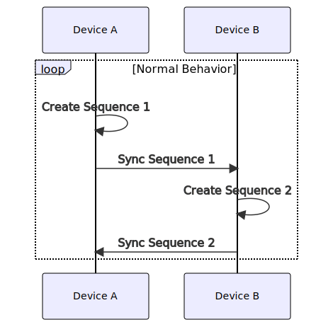
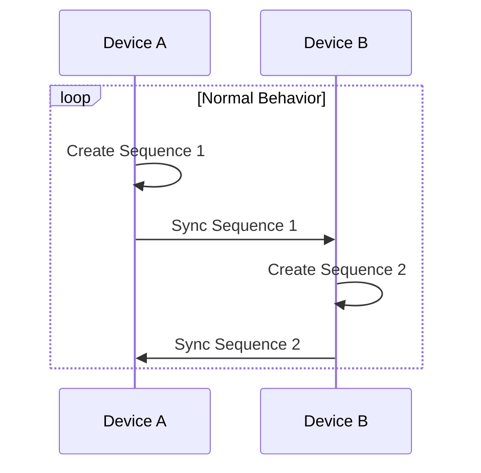
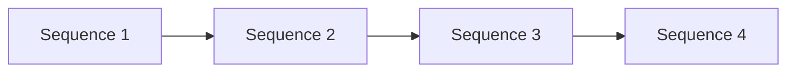
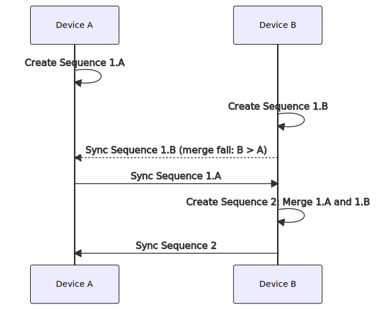
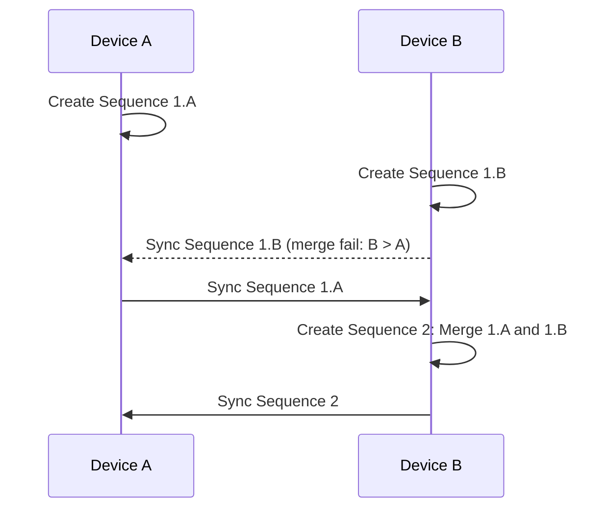
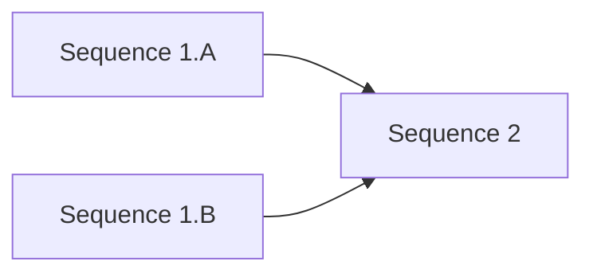
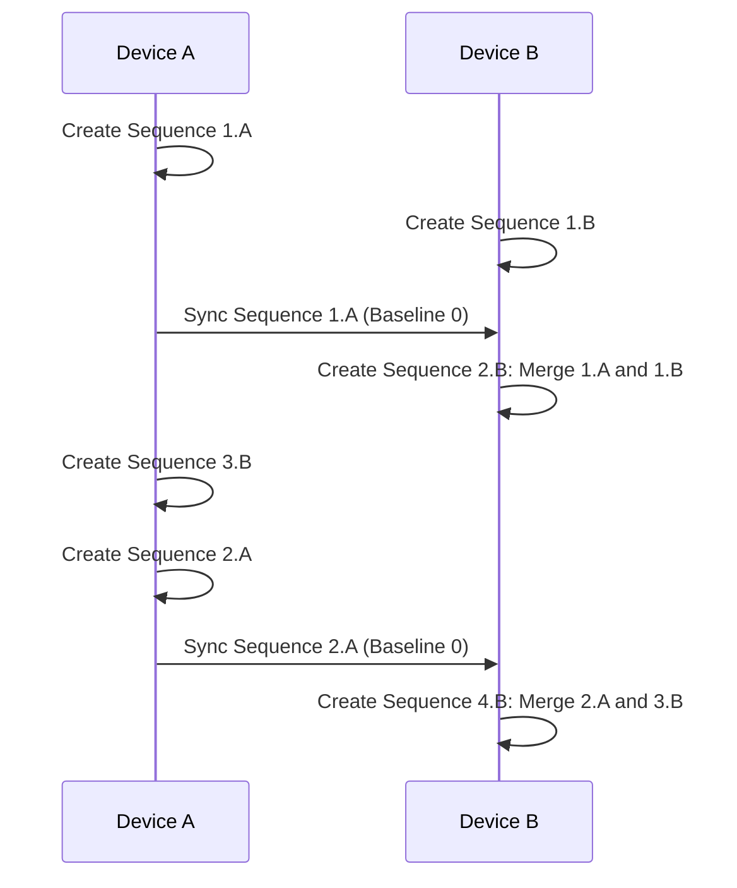

Sync between devices. Of course a server will be involved, but it's just an intermediary. The important decisions need to happen with the devices.

Rules:

* Merge only from lower Device IDs.
* Merge baseline is the most recent version they both claim to have seen

Con:

* Slow
* Some messy merges
* Need all devices connected at once to guarantee sync goes through(?)

Pro:

* Allow for devices to come in and out
* Unambiguous final resolution

# Normal syncing

Usually changes will come one device at a time

# Sync in one direction

Device IDs will be unique, and we can order them. (We could even order desktop clients over phone clients if that's an easier merging experience for users.) We will only allow merging syncs to happen from a lower device ID to a higher one.

Since we're communicating with a server, devices can't directly know when their messages has reached another device. If we allowed sync in both directions, it would be possible for both devices to sync each other. For a complicated merge, it would require the user to manually merge the same thing on both devices. If the user were able to merge it differently between the devices, it would create a conflicting state, and it would be unclear how devices could communicate it to each other and resolve it.

Making sync one-direction is much simpler. Consistency takes longer to achieve but this is not a high priority.

# Merge baselines

Conflict resolution requires not only the two versions of the wallet being merged. It also requires a baseline version of the wallet. When Device B merges in changes from Device A, the baseline it will use is the last version of Device A that was successfully synced from Device B. Since Device A never _merges_ from Device B, we expect that a successful sync will mean a direct copy of the version in question.

TODO - that means that Device B also needs a copy of everything it merges to Device A. Every version it ever syncs, it needs to keep around, in case a future merging device needs it for a baseline.
  Maybe Device A just sends it back to Device B? With a signature as well, wtf?
  Okay, Device B keeps around _hashes_ of every version it ever makes, along wiht the sequence number, so that if Device A sends it _back_, it confirms that it's legit.

# Redundant syncs

If Device B merges in changes from Device A, Device B might not report its newly merged version back to Device A before Device A has more changes. Once Device merges in those new changes, Device B will need to know the fact that Device A hasn't received those changes yet. Thus, it needs to report a _baseline_, which represents the last time it has recieved a version from Device B.

-- TODO - new device appears in the middle of the sequence. how will it merge in? etc etc.

-- TODO - the oddball sequences that I came up with in states.md

-- TODO - Complicated: 2-way syncs, optimize by the existing partial merge. might avoid some repeated merges. (add this note to that section)

-- TODO - Complicated: 3-way syncs, can't avoid repeated merges given our simple history system (add this note to that section)
