Sync between devices and server. We rely on the devices to stop the server from lying to us, so we don't have a corrupted sync state (high stakes). We rely on the server to be honest so we don't have the inconvenience of the devices warning us about anything (low stakes).

The server's job is to refuse cases that would lead other clients to later throw errors. This may also include discovering that the requesting client is buggy and produced invalid data.

Note:

* device.walletState represents the state of the wallet at the point of last confirmed successful sync, in eihter direction, with the server.
* newWalletState represents a wallet that the client has newly minted and is sending to the server to accept as its new state. It should have a new sequence number, all local changes since the last sync including merges.

Client goes into error recovery mode if:

* The server's sequence somehow decreased since last confirmed successful sync:
  * server.walletState.sequence < device.walletState.sequence
* The server's walletState changed, but the sequence is the same as it was before
  * server.walletState.sequence == device.walletState.sequence && server.walletState != device.walletState
* The server's walletState includes all changes on this device up to the last successful sync:
  * server.walletState.lastSyncedById[Dev.Id].sequence != device.walletState.sequence
  * server.walletState.lastSyncedById[Dev.Id].hash != device.walletState.hash
* The server's walletState lastSyncedById are at least as up-to-date as the current walletState
  * server.walletState.lastSyncedById[id].sequence < device.walletState.lastSyncedById[id].sequence for all device ids
* The server's walletState lastSyncedById passes basic sanity checks
  * TODO ... maybe there's nothing more here? Maybe the diff in sequence numbers should equal the sum of the diffs of the lastSyncedByIds

Server refuses new wallet if:

* The new wallet's sequence isn't an increment of the server's current sequence
  * newWalletState.sequence != server.walletState.sequence + 1
* Sanity check: the new walletState has its own lastSyncedById match its own sequence and hash
  * newWalletState.lastSyncedById[Dev.Id].sequence != newWalletState.sequence
  * newWalletState.lastSyncedById[Dev.Id].hash != newWalletState.hash
* The server's walletState lastSyncedById for all _other_ devices is as up-to-date as the server's walletState
  * server.walletState.lastSyncedById[id].sequence != newWalletState.lastSyncedById[id].sequence for all other device ids
  * server.walletState.lastSyncedById[id].hash != newWalletState.lastSyncedById[id].hash for all other device ids

# Basic Syncing, every update seen by other device

The most basic scenario is that every time a device makes a local change to its wallet and pushes it to the server, every other device downloads it promptly. The first device (or any other device) later makes more changes and again pushes them to the server, other devices download them promptly, and so on.

Each new version that gets pushed to the server has a new Sequence number that the server and devices use to make sure everything is up to date, and changes are not overwritten. More on this below.

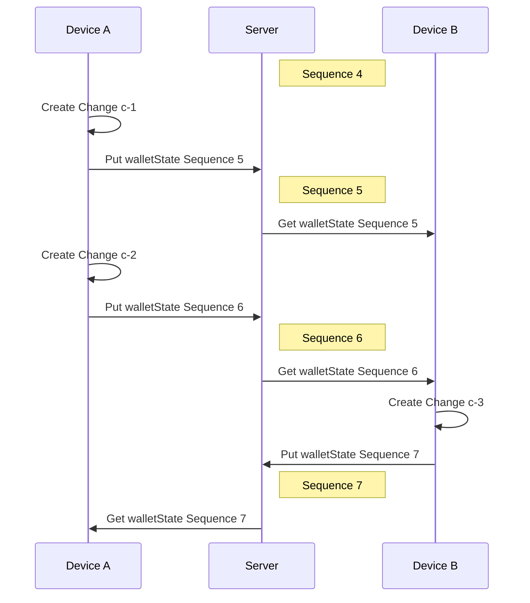

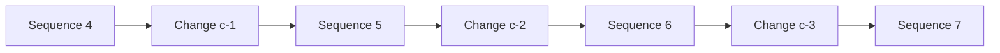

# Basic Syncing, not every update seen by other device

A slightly less basic scenario is one where a device creates and uploads two or more wallet changes before other devices download them. This may happen if the receiving devices are offline, if there are network issues, etc. As before, the sequence number increments for each upload. The device that downloads the update sees that the Sequence number has increaed by more than 1, but so long as it's a higher number than the last one it downloaded, it knows it's newer and there is no problem.

Note that at this point the first device has no way of knowing which other devices have received which of its updates.

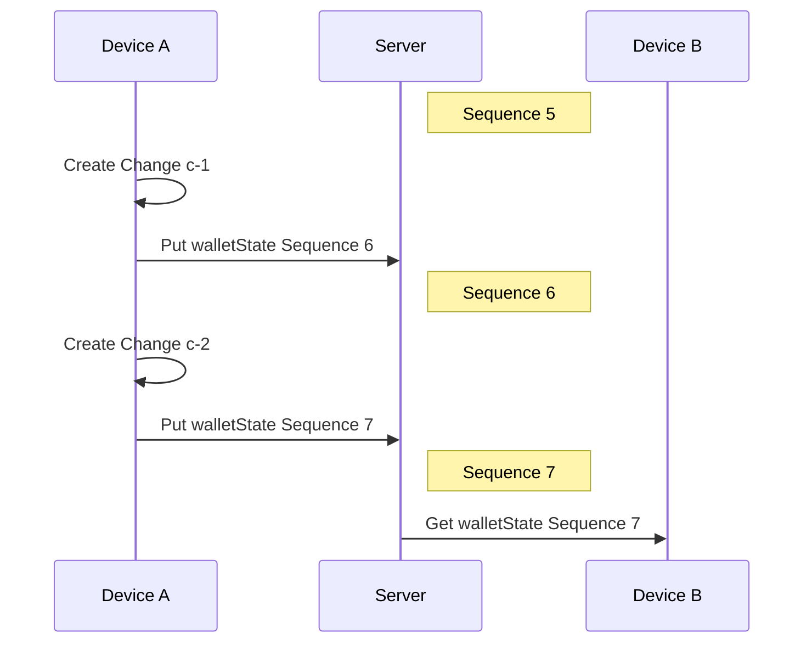

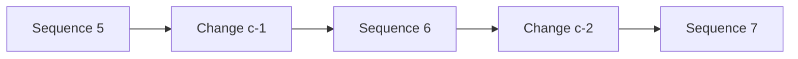

# Merging - Basic

Now we introduce merging, and the scenario gets a little more complicated. Device A and Device B _both_ make changes c-1 and c-2 respectively, as in an earlier example. However here they both make their changes at around the same time. Device A pushes its change as Sequence 6, and Device B downloads it.

At this point, Device B can't simply accept this new version or it would lose Change c-2. It performs a **merge** between Sequence 6 (which includes Change c-1) and its own local state (which includes Change c-2). Changes c-5 and c-6 are both on top of Sequence 5, which makes Sequence 5 the **baseline** of this merge. The baseline is the most recent common version between the two versions to be merged.

In some cases, particularly if c-1 and c-2 both affect the same part of the data, this merge will require interaction from the user in order to resolve it.

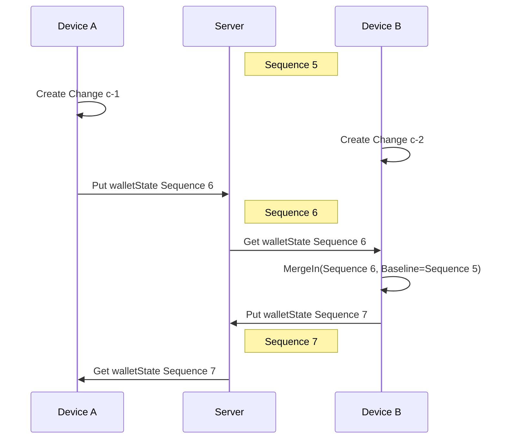

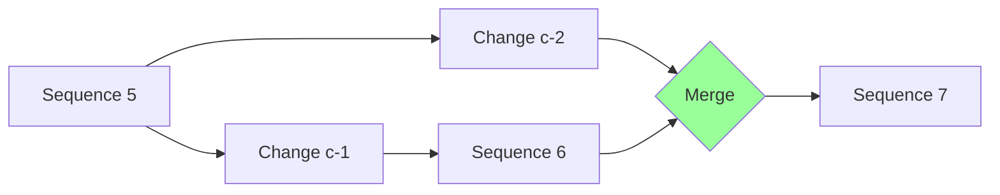

# Merging - Timing, conflict on server

What if the actions of Device A and Device B in the previous scenario were even more concurrent?

Let's alter the previous scenario slightly, and now suppose that the timing is such that Device B doesn't notice in time that Device A pushed Sequence 6 to the server. Device B tries pushing its local version (with Change c-2) as Sequence 6. The server rejects it because it will not accept Sequence 6 a second time. (Here we assume that the server is behaving correctly. We will see later that we have some provisions in case it is not.).

Device B takes this as an indication that it is not up to date. It downloads Sequence 6 from the server and proceeds with the merge as in the previous example.

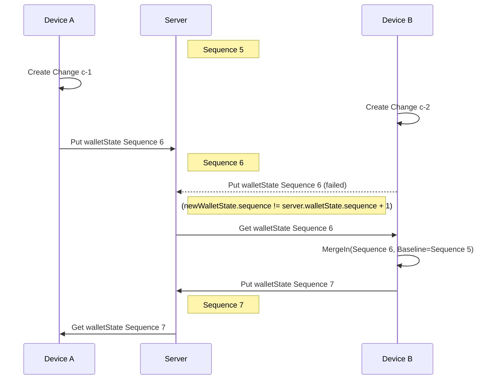

# Merging - Multiple Incoming

Now let's alter the scenario a little more. This time, Device B is forced to merge in changes from Device A _twice_ before being able to push back the result.

It begins the same way as before: Device A and Device B both create changes (c-1 and c-2 respectively). They both try to push their updated wallets as Sequence 6, and Device A gets there first. Device B is blocked, and pulls the new Sequence 6 (just created by Device A) from the server.

Device B merges in its local changes (containing Change c-2) with Sequence 6 (containing c-1). Again, Sequence 5 is the merge baseline.

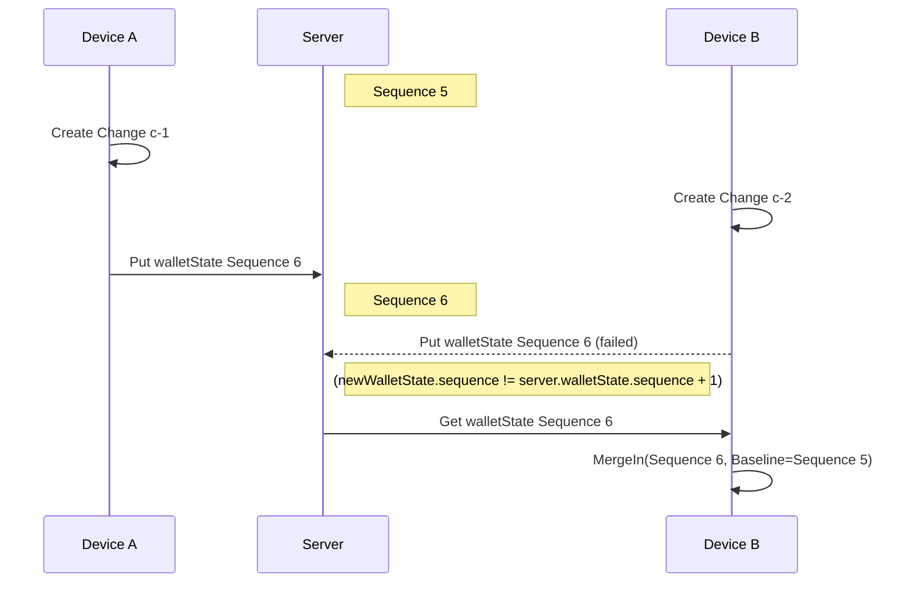

However this time, before Device B can push its merge of c-1 and Sequence 6 as Sequence 7, Device A creates a new wallet change, c-3, and pushes the updated wallet to the server as Sequence 7. Device B _again_ fails to push due to Device A getting there first. Device B again pulls from the server to get the new wallet created by Device A, Sequence 7.

At this point, the previous merge on Device B is **discarded**. Device B merges in its Change c-2 with Sequence 7 (containing c-1 and c-3 created by Device A). The common base of c-1, c-2 and c-3 is still Sequence 5, so *Sequence 5 will still be the merge baseline*.

Finally, Device B is able to send back its merged wallet uninterrupted as Sequence 8.

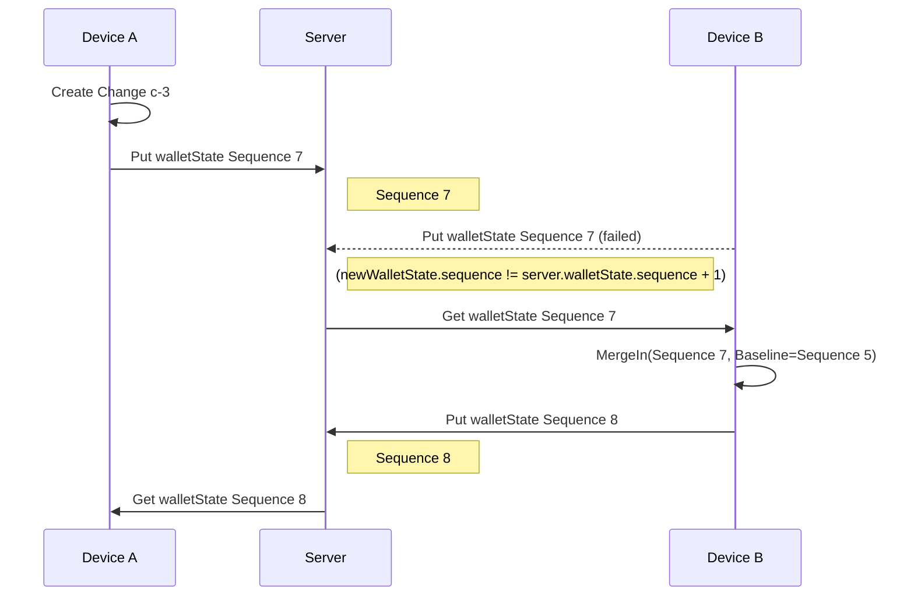

The resulting version graph shows the simple relationship between versions (identified by "Sequence" numbers) and changes, despite the first failed attempt at a merge.

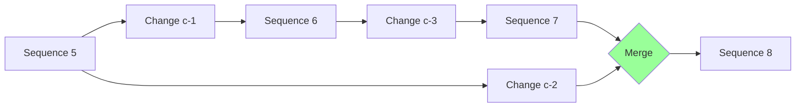

If the failed merge of c-1 and c-2 required user interaction, that interaction would need to be repeated when merging c-1 c-2 and c-3. This is a trade off of user convenience for simplicity in design, but this is expected to be a rare case.

NOTE: If this becomes a big usability problem, perhaps it would be possible to save some sort of intermediate state from the first merge attempt to avoid doing it the second time.

# Dishonest Server - Altered Wallet

Devices will notice if the server tampers with a walletState (including changing metadata such as the Sequence number) because the signature will fail. If a device receives a tampered walletState from the server, it will enter Error Recovery Mode.

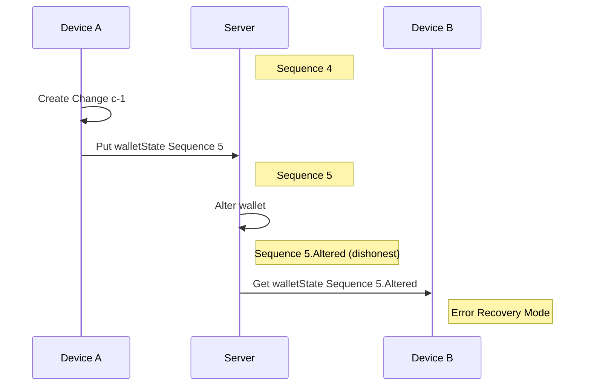

# Dishonest Server - Lower Sequence

What if the server were dishonest - presenting older versions of the walletState to devices? The wallet will discover it right away and enter Error Recovery Mode.

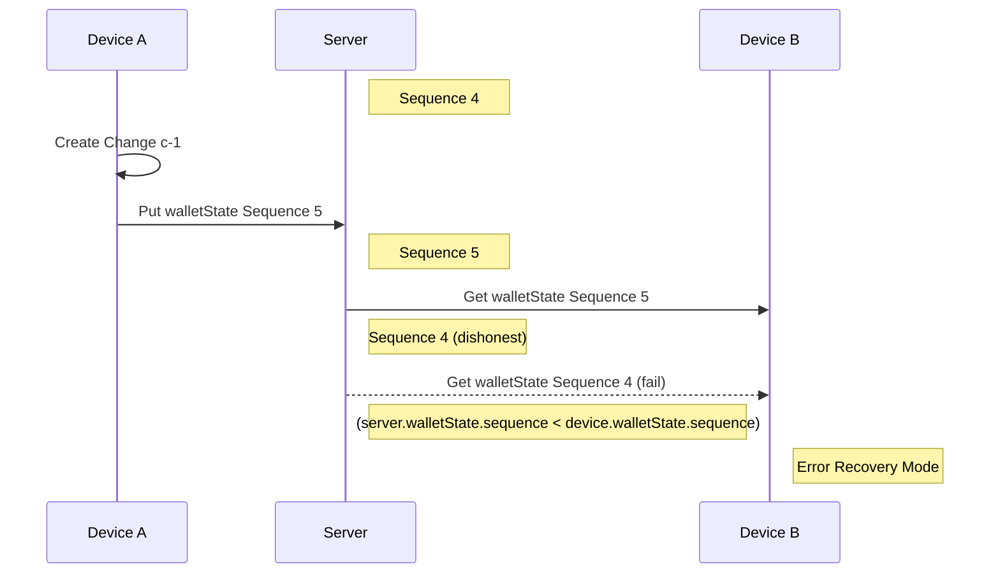

# Dishonest Server - Merging Divergent Histories

Let's say the dishonest (or maybe buggy) server is split into states: ServerX and ServerY, with the goal of trying to trick the devices into an inconsistent sync state. This would be a situation where the sequence numbers are the same, the data may be similar, but it's not exactly the same.

The servers will start the with the same state, and both devices are up to date. The current walletState has a sequence of 5 and was pushed by Device B. (sequence 4 was previously pushed by Device A).

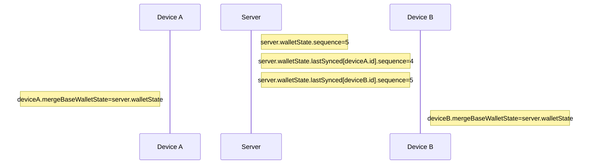

Next, both devices make local changes and push their walletState with Sequence 6. An honest server would reject at least one of them. In this case, the server dishonestly creates an alternate timeline for each, as ServerX and ServerY. For convenience, we will refer to these sequences as Sequence 6.A and Sequence 6.B, but of course the sequence value for both will simply be 6:

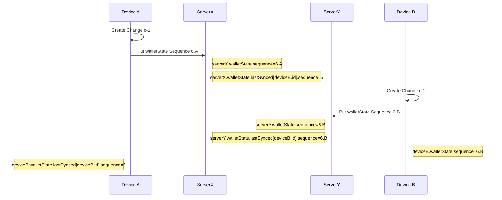

Now the server attempts to cause trouble by connecting Device B to ServerX. Device B pulls, and sees Sequence 6.A:

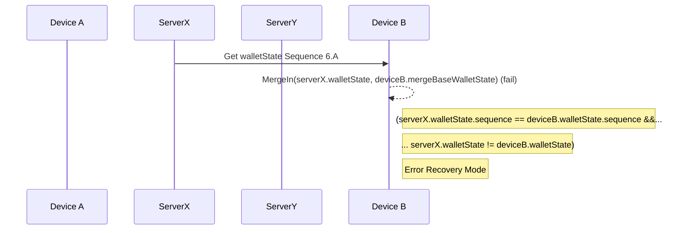

Device B can see that the walletState's sequence number didn't change, and yet the walletState is different. This is a straightforward indication that things are not going as expected, so it enters Error Recovery Mode.

But what if the dishonest server was a little smarter. Instead of giving Device B access to Sequence 6.A, it waits until Device A makes one more change and pushes Sequence 7. Again, Device A doesn't know about Sequence 6.B, so it still believes that Device B's merge base is 5:

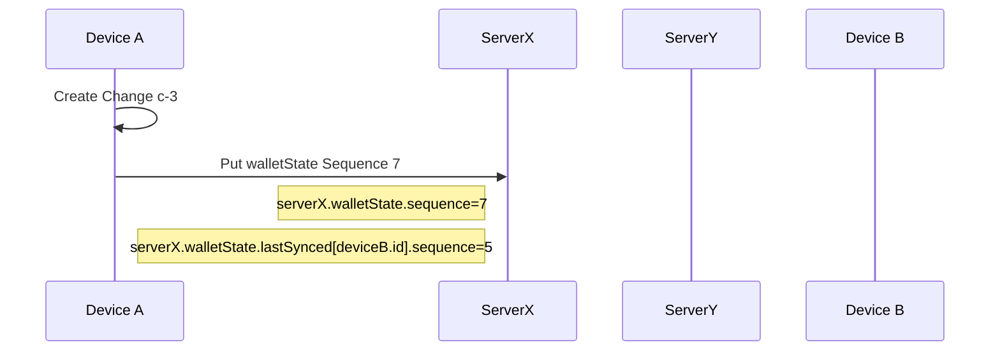

Now once again the server attempts to cause trouble by connecting Device B to ServerX, attempting to trick Device B into accepting Sequence 7:

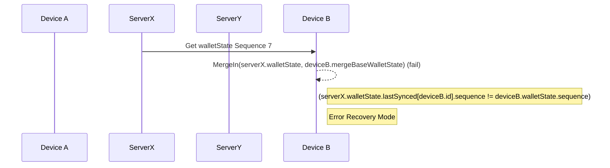

Because Device B last pushed Sequence 6.B, it doesn't see anything wrong by looking merely at the sequence number. What would happen if it accepted it?

With an honest server, if Device B successfully pushed Sequence 6.B, Sequence 7 would include Changes c-1, c-2, and c-3. Because of our tricky server diverging the histories, it does not include Change c-2.

Logically speaking, Sequence 5 is the proper merge base between Sequence 7 and Sequence 6.B:

However, Device B considers Sequence 6B to be the merge base. This means that if Device B were to accept Sequence 7, it would effectively _revert_ Change c-2:

Device B prevents this by looking at `lastSynced`. Device B sees that `serverX.walletState.lastSynced[deviceB.id]` is still 5, while `deviceB.walletState.sequence` is 6. This tells Device B that Sequence 7 does not include Sequence 6.B (and thus Change c-2). It means that somehow or other, the server and clients got into an inconsistent state. To prevent further trouble, Device B goes into Error Recovery Mode.

The server cannot forge `lastSynced`. A device could forge it, but again, in our model we necessarily assume that the devices are trusted.

NOTE: An advancement we could make would be to store more historical versions. In this case, if Device B happened to have Sequence 5 lying around, it could recover. But, the user may need to manually merge the changes between 5 and 6.B twice. Also, this might lead to servers being less disciplined. And it adds complication. But, it's an option for consideration.

# Network issues

TODO

I pushed Seq 4. I make changes. I push Seq 5. B/c of network error I'm not sure if I succeeded. I push again just in case. It's now rejected. I pull. What merge base will it claim?

I need to have both Seq 4 and Seq 5 around until the server confirms to me which is the last one that succeeded. It could lie to me about what it accepted, but I would catch it when it came time to merge something else, as described in a previous scenario,

For this reason, server should always confirm committing the change locally before returning a success. (server commit change should be a self-action in this example)

# Three Devices

TODO - maybe lots to consider

# New device appears in the middle of the sequence

TODO - how will it merge in? etc etc.

# TODO

Merge this document with states.md? What should be charts vs the math notation?

Some oddball sequences that I came up with in states.md may want charts. And vice versa.
