Sync between devices and server. We rely on the devices to stop the server from lying to us, so we don't have a corrupted sync state (high stakes). We rely on the server to be honest so we don't have the inconvenience of the devices warning us about anything (low stakes).

The server's job is to refuse cases that would lead other clients to later throw errors. This may also include discovering that the requesting client is buggy and produced invalid data.

Note:

* device.walletState represents the state of the wallet at the point of last confirmed successful sync, in eihter direction, with the server.
* newWalletState represents a wallet that the client has newly minted and is sending to the server to accept as its new state. It should have a new sequence number, all local changes since the last sync including merges.

Client goes into error recovery mode if:

* The server's sequence somehow decreased since last confirmed successful sync:
  * server.walletState.sequence < device.walletState.sequence
* The server's walletState changed, but the sequence is the same as it was before
  * server.walletState.sequence == device.walletState.sequence && server.walletState != device.walletState
* The server's walletState includes all changes on this device up to the last successful sync:
  * server.walletState.lastSyncedById[Dev.Id].sequence != device.walletState.sequence
  * server.walletState.lastSyncedById[Dev.Id].hash != device.walletState.hash
* The server's walletState lastSyncedById are at least as up-to-date as the current walletState
  * server.walletState.lastSyncedById[id].sequence < device.walletState.lastSyncedById[id].sequence for all device ids
* The server's walletState lastSyncedById passes basic sanity checks
  * TODO ... maybe there's nothing more here? Maybe the diff in sequence numbers should equal the sum of the diffs of the lastSyncedByIds

Server refuses new wallet if:

* The new wallet's sequence isn't an increment of the server's current sequence
  * newWalletState.sequence != server.walletState.sequence + 1
* Sanity check: the new walletState has its own lastSyncedById match its own sequence and hash
  * newWalletState.lastSyncedById[Dev.Id].sequence != newWalletState.sequence
  * newWalletState.lastSyncedById[Dev.Id].hash != newWalletState.hash
* The server's walletState lastSyncedById for all _other_ devices is as up-to-date as the server's walletState
  * server.walletState.lastSyncedById[id].sequence != newWalletState.lastSyncedById[id].sequence for all other device ids
  * server.walletState.lastSyncedById[id].hash != newWalletState.lastSyncedById[id].hash for all other device ids

# Basic Syncing, every update seen by other device

Devices make changes and send them to the server, incrementing sync number each time. The other device receives every version.

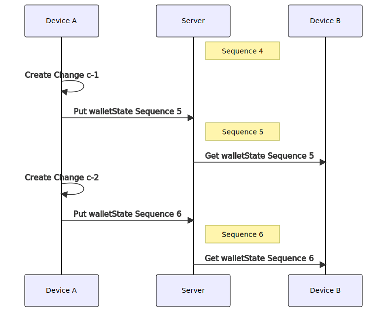

source

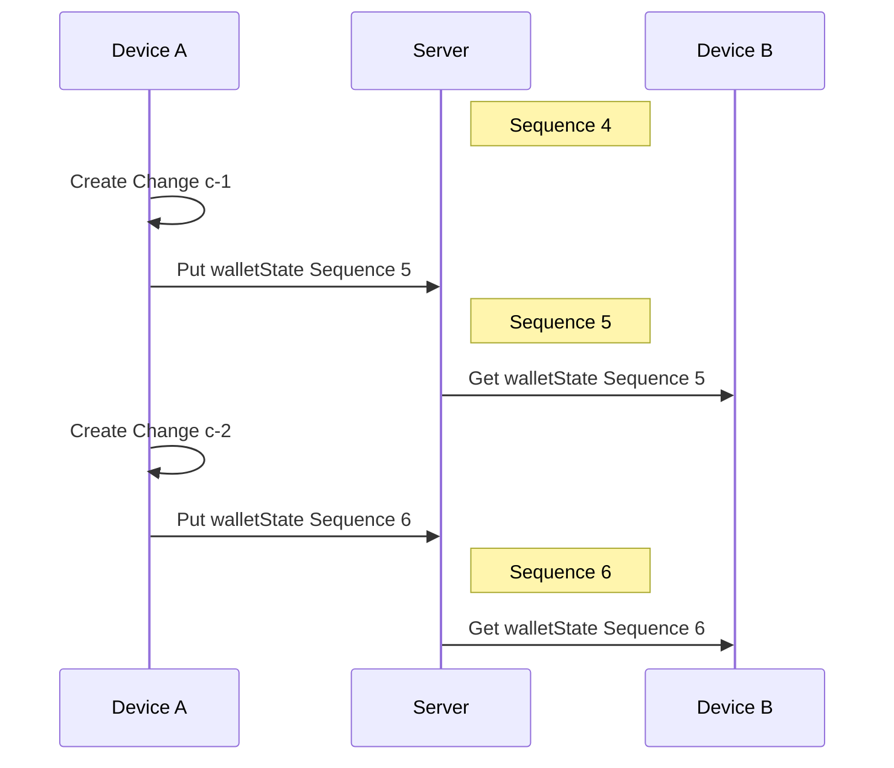
```mermaid
  sequenceDiagram
    participant Device A
    participant Server
    participant Device B

    Note right of Server: Sequence 4

    Device A->>Device A: Create Change c-1
    Device A->>Server: Put walletState Sequence 5
    Note right of Server: Sequence 5
    Server->>Device B: Get walletState Sequence 5
    Device A->>Device A: Create Change c-2
    Device A->>Server: Put walletState Sequence 6
    Note right of Server: Sequence 6
    Server->>Device B: Get walletState Sequence 6
```

source

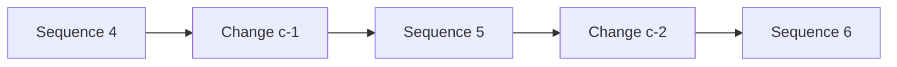
```mermaid
  flowchart LR
    s4[Sequence 4]
    s5[Sequence 5]
    s6[Sequence 6]
    c1[Change c-1]
    c2[Change c-2]

    s4 --> c1
    c1 --> s5
    s5 --> c2
    c2 --> s6
```

# Basic Syncing, not every update seen by other device

Devices make changes and send them to the server, incrementing sync number each time. The other device doesn't receive every version (perhaps due to network issues). Devices have no way of knowing whether every other device in the system has received their updates (until those clients make their own changes and sends them to the server).

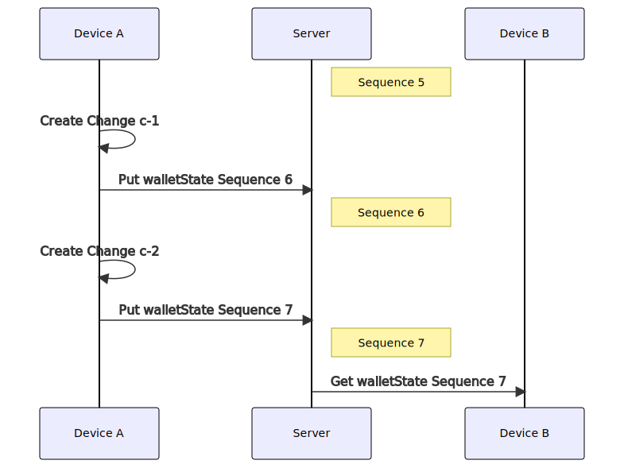

source

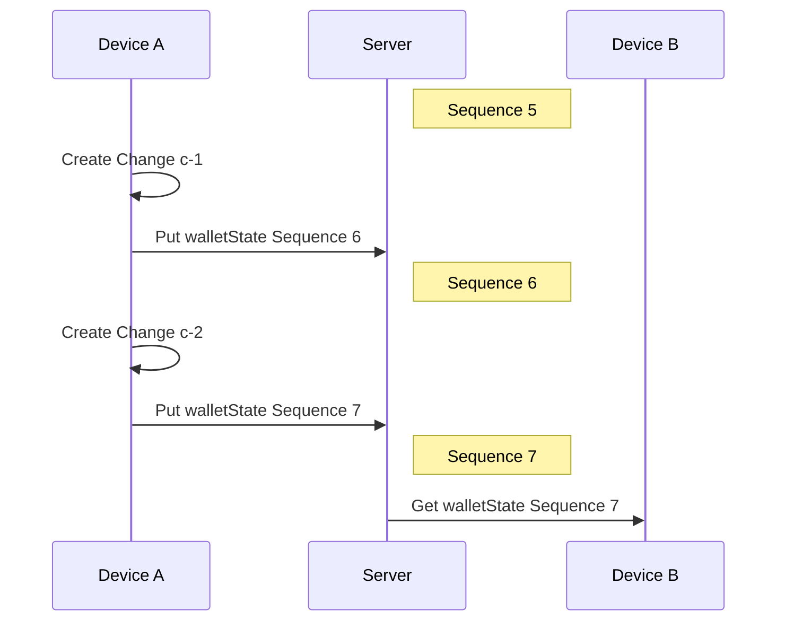
```mermaid
  sequenceDiagram
    participant Device A
    participant Server
    participant Device B

    Note right of Server: Sequence 5

    Device A->>Device A: Create Change c-1
    Device A->>Server: Put walletState Sequence 6
    Note right of Server: Sequence 6
    Device A->>Device A: Create Change c-2
    Device A->>Server: Put walletState Sequence 7
    Note right of Server: Sequence 7
    Server->>Device B: Get walletState Sequence 7
```

source

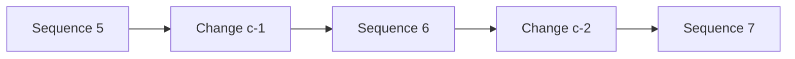
```mermaid
  flowchart LR
    s5[Sequence 5]
    s6[Sequence 6]
    s7[Sequence 7]
    c1[Change c-1]
    c2[Change c-2]

    s5 --> c1 --> s6 --> c2 --> s7
```

# Merging - Basic

Both devices make changes. Device A is able to send its changes to the server. Device B is blocked when it tries to send because Device A got there first. Device B first has to pull in Device A's changes from the server, merge the changes together, and send the result back.

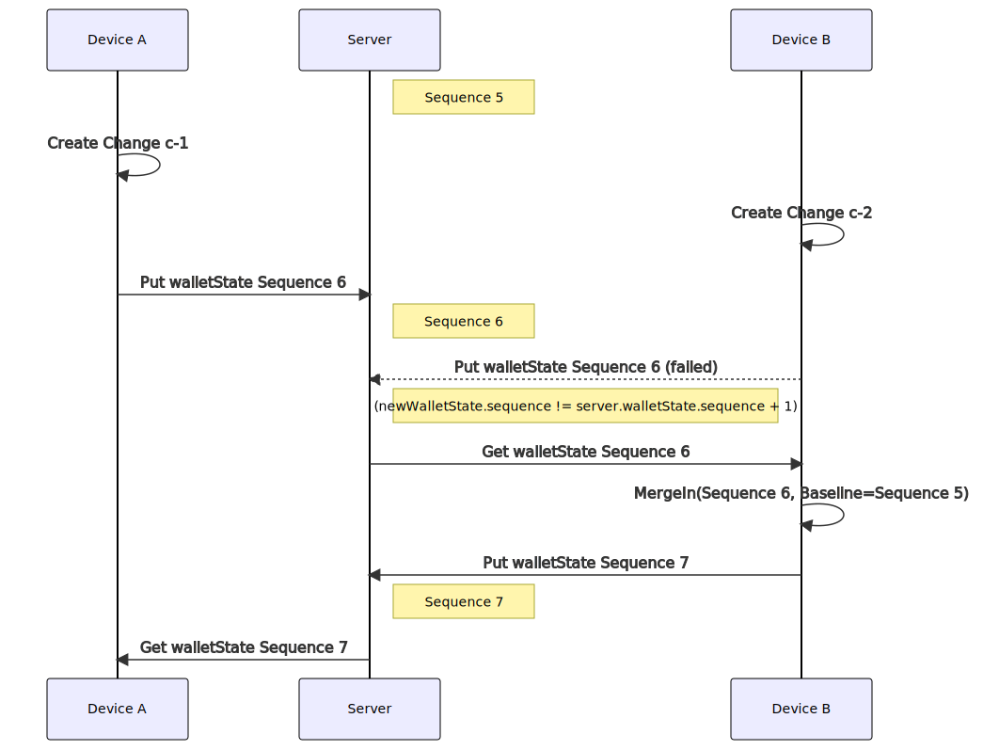

source

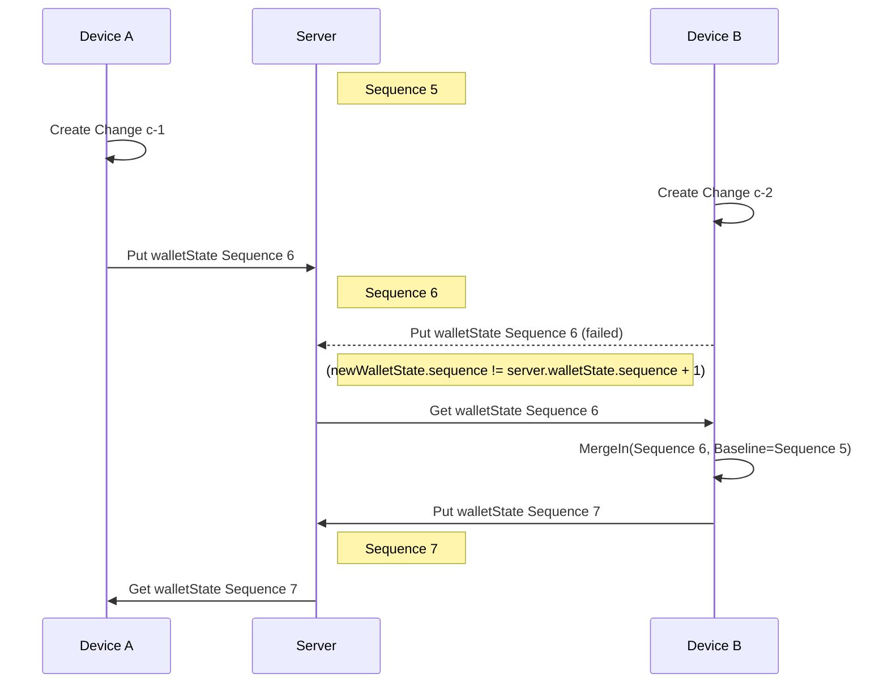
```mermaid
  sequenceDiagram
    participant Device A
    participant Server
    participant Device B

    Note right of Server: Sequence 5

    Device A->>Device A: Create Change c-1
    Device B->>Device B: Create Change c-2
    Device A->>Server: Put walletState Sequence 6
    Note right of Server: Sequence 6
    Device B-->>Server: Put walletState Sequence 6 (failed)
    Note right of Server: (newWalletState.sequence != server.walletState.sequence + 1)

    Server->>Device B: Get walletState Sequence 6
    Device B->>Device B: MergeIn(Sequence 6, Baseline=Sequence 5)

    Device B->>Server: Put walletState Sequence 7
    Note right of Server: Sequence 7
    Server->>Device A: Get walletState Sequence 7
```



source

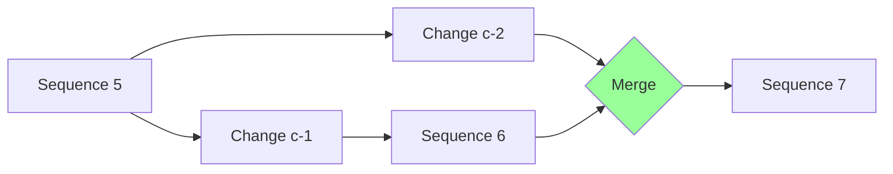
```mermaid
  flowchart LR
    s5[Sequence 5]
    s6[Sequence 6]
    s7[Sequence 7]
    c1[Change c-1]
    c2[Change c-2]
    m{Merge}

    s5 --> c1
    c1 --> s6

    s5 --> c2
    c2 & s6 --> m
    m  --> s7

    style m fill:#9f9
```

# Merging - Multiple Incoming

TODO - This one is a WIP.

This has to do with merging in multiple times before pushing back. For simplicity, we should reuse the same merge base, which would be bad for usability since it could require resolving teh same conflict twice. But it would be rare.

NOTE: An advancement we could make would be to have intermittent merge bases. We may need to alo store the original merge base of sequence 5 (see below).

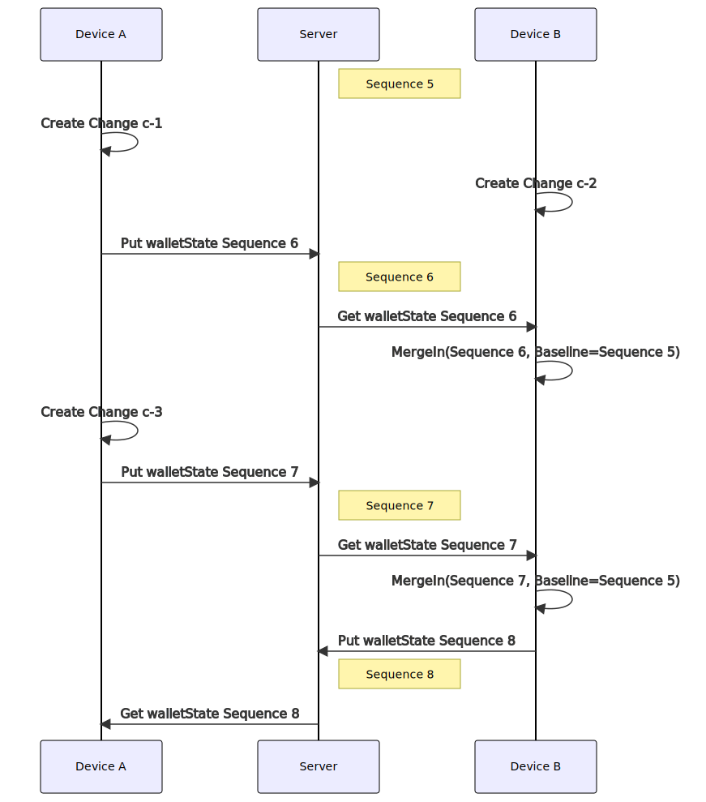

source

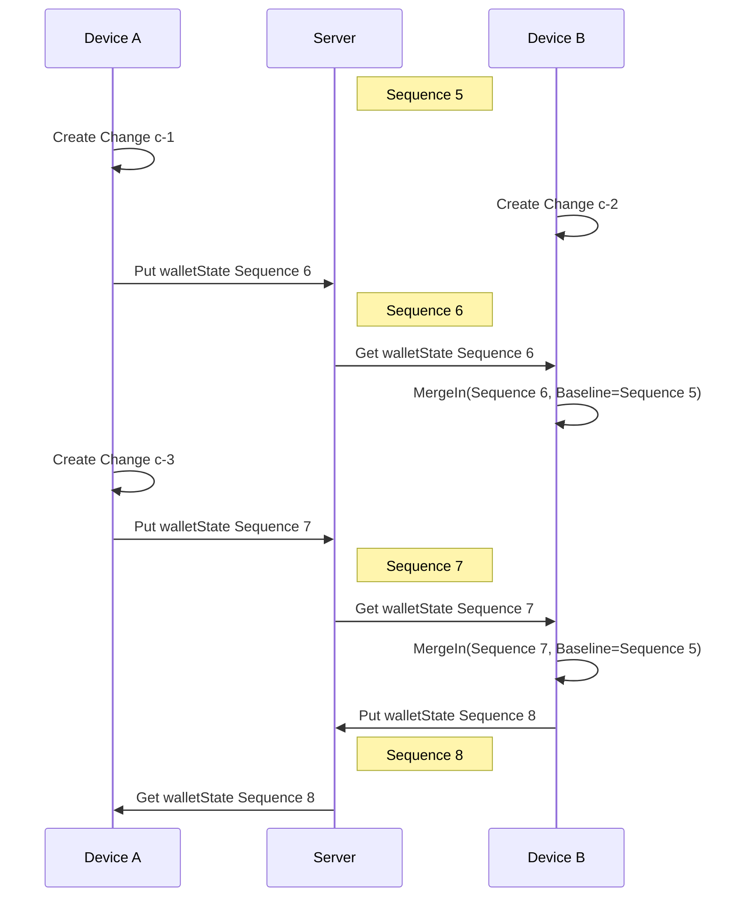
```mermaid
  sequenceDiagram
    participant Device A
    participant Server
    participant Device B

    Note right of Server: Sequence 5

    Device A->>Device A: Create Change c-1
    Device B->>Device B: Create Change c-2
    Device A->>Server: Put walletState Sequence 6
    Note right of Server: Sequence 6

    Server->>Device B: Get walletState Sequence 6
    Device B->>Device B: MergeIn(Sequence 6, Baseline=Sequence 5)

    Device A->>Device A: Create Change c-3

    Device A->>Server: Put walletState Sequence 7
    Note right of Server: Sequence 7

    Server->>Device B: Get walletState Sequence 7
    Device B->>Device B: MergeIn(Sequence 7, Baseline=Sequence 5)

    Device B->>Server: Put walletState Sequence 8
    Note right of Server: Sequence 8
    Server->>Device A: Get walletState Sequence 8
```



source

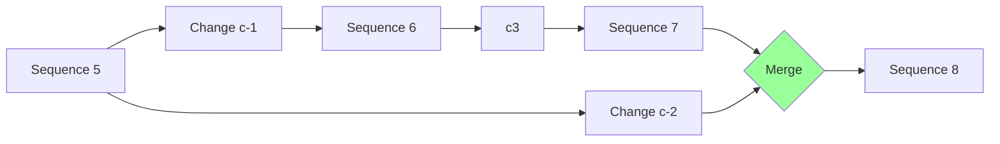
```mermaid
  flowchart LR
    s5[Sequence 5]
    s6[Sequence 6]
    s7[Sequence 7]
    s8[Sequence 8]
    c1[Change c-1]
    c2[Change c-2]
    m{Merge}

    s5 --> c1 --> s6 --> c3 --> s7 --> m
    s5 --> c2 --> m
    m --> s8

    style m fill:#9f9
```

# Dishonest Server - Altered Wallet

TODO - server edits sequence number. Device stops it by checking signature.

# Dishonest Server - Lower Sequence

What if the server were dishonest - presenting older versions of the walletState to devices? The wallet will discover it right away and enter Error Recovery Mode.

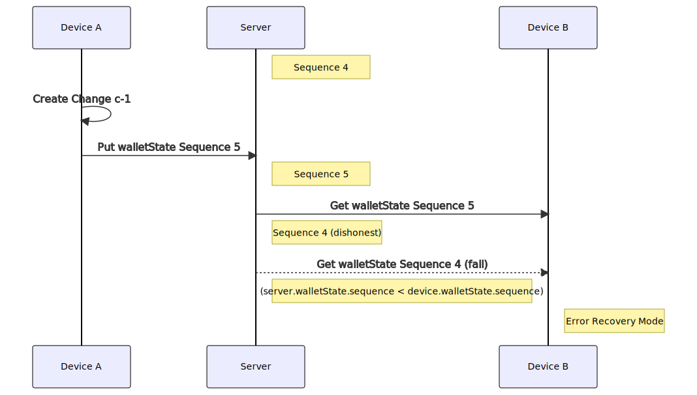

source

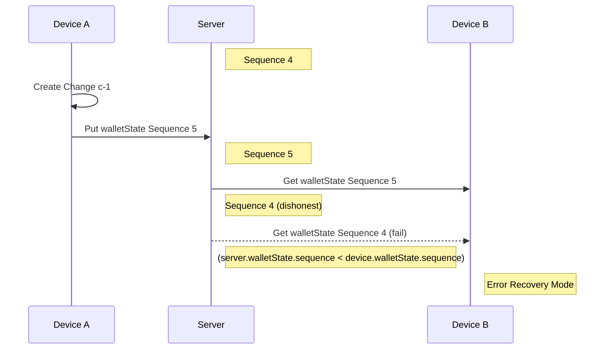
```mermaid
  sequenceDiagram
    participant Device A
    participant Server
    participant Device B

    Note right of Server: Sequence 4

    Device A->>Device A: Create Change c-1
    Device A->>Server: Put walletState Sequence 5
    Note right of Server: Sequence 5
    Server->>Device B: Get walletState Sequence 5
    Note right of Server: Sequence 4 (dishonest)
    Server-->>Device B: Get walletState Sequence 4 (fail)
    Note left of Device B: (server.walletState.sequence < device.walletState.sequence)
    Note right of Device B: Error Recovery Mode
```

# Dishonest Server - Merging Divergent Histories

Let's say the dishonest (or maybe buggy) server is split into states: ServerX and ServerY, with the goal of trying to trick the devices into an inconsistent sync state. This would be a situation where the sequence numbers are the same, the data may be similar, but it's not exactly the same.

The servers will start the with the same state, and both devices are up to date. The current walletState has a sequence of 5 and was pushed by Device B. (sequence 4 was previously pushed by Device A).

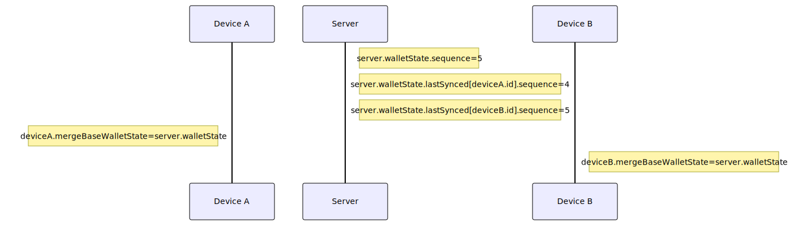

source

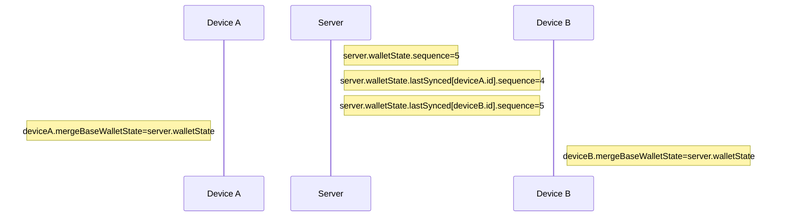
```mermaid
  sequenceDiagram
    participant Device A
    participant Server
    participant Device B

    Note right of Server: server.walletState.sequence=5
    Note right of Server: server.walletState.lastSynced[deviceA.id].sequence=4
    Note right of Server: server.walletState.lastSynced[deviceB.id].sequence=5
    Note left of Device A: deviceA.mergeBaseWalletState=server.walletState
    Note right of Device B: deviceB.mergeBaseWalletState=server.walletState
```

Next, both devices make local changes and push their walletState with Sequence 6. An honest server would reject at least one of them. In this case, the server dishonestly creates an alternate timeline for each, as ServerX and ServerY. For convenience, we will refer to these sequences as Sequence 6.A and Sequence 6.B, but of course the sequence value for both will simply be 6:

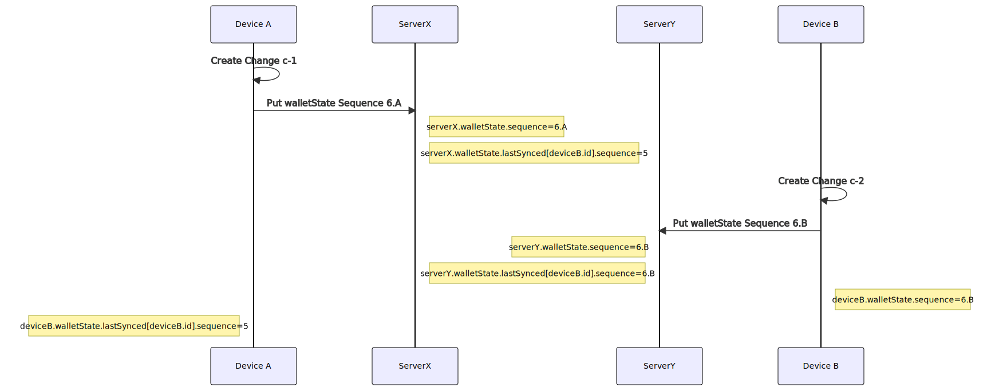

source

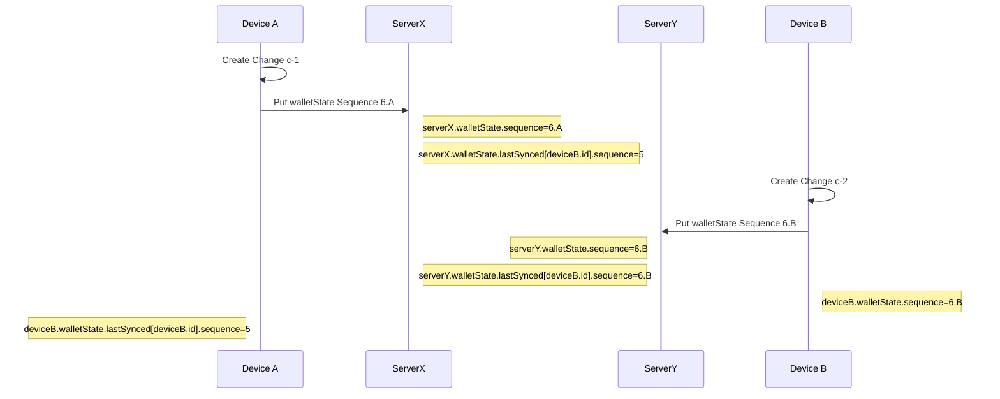
```mermaid
  sequenceDiagram
    participant Device A
    participant ServerX
    participant ServerY
    participant Device B

    Device A->>Device A: Create Change c-1
    Device A->>ServerX: Put walletState Sequence 6.A

    Note right of ServerX: serverX.walletState.sequence=6.A
    Note right of ServerX: serverX.walletState.lastSynced[deviceB.id].sequence=5

    Device B->>Device B: Create Change c-2
    Device B->>ServerY: Put walletState Sequence 6.B
    Note left of ServerY: serverY.walletState.sequence=6.B
    Note left of ServerY: serverY.walletState.lastSynced[deviceB.id].sequence=6.B

    Note right of Device B: deviceB.walletState.sequence=6.B
    Note left of Device A: deviceB.walletState.lastSynced[deviceB.id].sequence=5
```

Now the server attempts to cause trouble by connecting Device B to ServerX. Device B pulls, and sees Sequence 6.A:

source

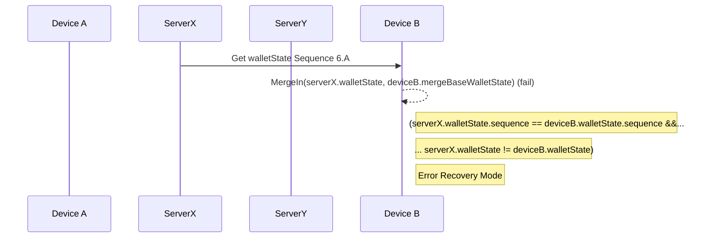
```mermaid
  sequenceDiagram
    participant Device A
    participant ServerX
    participant ServerY
    participant Device B


    ServerX->>Device B: Get walletState Sequence 6.A
    Device B-->>Device B: MergeIn(serverX.walletState, deviceB.mergeBaseWalletState) (fail)
    Note right of Device B: (serverX.walletState.sequence == deviceB.walletState.sequence &&...
    Note right of Device B: ... serverX.walletState != deviceB.walletState)
    Note right of Device B: Error Recovery Mode
```

Device B can see that the walletState's sequence number didn't change, and yet the walletState is different. This is a straightforward indication that things are not going as expected, so it enters Error Recovery Mode.

But what if the dishonest server was a little smarter. Instead of giving Device B access to Sequence 6.A, it waits until Device A makes one more change and pushes Sequence 7. Again, Device A doesn't know about Sequence 6.B, so it still believes that Device B's merge base is 5:

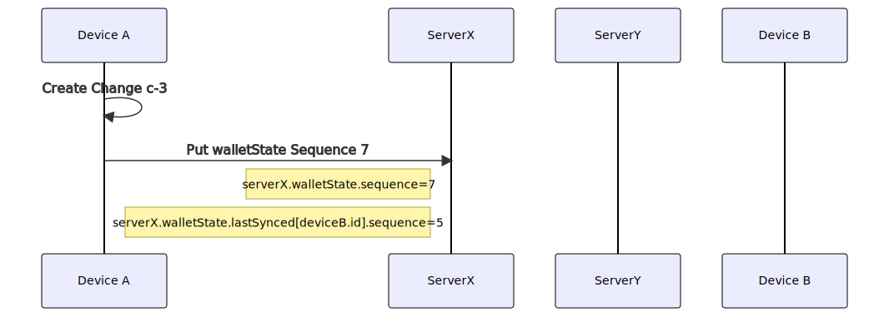

source

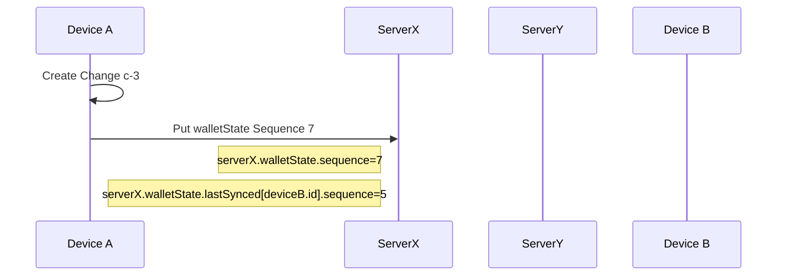
```mermaid
  sequenceDiagram
    participant Device A
    participant ServerX
    participant ServerY
    participant Device B

    Device A->>Device A: Create Change c-3
    Device A->>ServerX: Put walletState Sequence 7
    Note left of ServerX: serverX.walletState.sequence=7
    Note left of ServerX: serverX.walletState.lastSynced[deviceB.id].sequence=5
```

Now once again the server attempts to cause trouble by connecting Device B to ServerX, attempting to trick Device B into accepting Sequence 7:

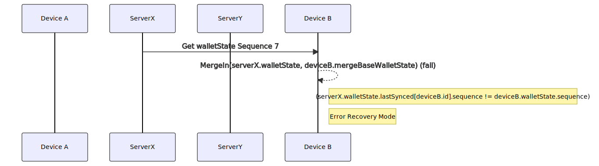

source

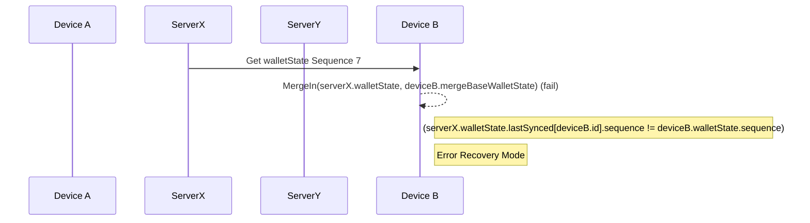
```mermaid
  sequenceDiagram
    participant Device A
    participant ServerX
    participant ServerY
    participant Device B


    ServerX->>Device B: Get walletState Sequence 7
    Device B-->>Device B: MergeIn(serverX.walletState, deviceB.mergeBaseWalletState) (fail)
    Note right of Device B: (serverX.walletState.lastSynced[deviceB.id].sequence != deviceB.walletState.sequence)
    Note right of Device B: Error Recovery Mode
```

Because Device B last pushed Sequence 6.B, it doesn't see anything wrong by looking merely at the sequence number. What would happen if it accepted it?

With an honest server, if Device B successfully pushed Sequence 6.B, Sequence 7 would include Changes c-1, c-2, and c-3. Because of our tricky server diverging the histories, it does not include Change c-2.

Logically speaking, Sequence 5 is the proper merge base between Sequence 7 and Sequence 6.B:



source

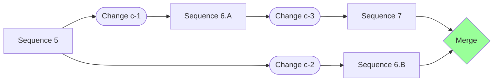
```mermaid
  flowchart LR
    s5[Sequence 5]
    s6a[Sequence 6.A]
    s6b[Sequence 6.B]
    s7a[Sequence 7]
    c1([Change c-1])
    c2([Change c-2])
    c3([Change c-3])
    m{Merge}

    s5 --> c1 --> s6a --> c3 --> s7a --> m
    s5 --> c2 --> s6b --> m

    style m fill:#9f9
```

However, Device B considers Sequence 6B to be the merge base. This means that if Device B were to accept Sequence 7, it would effectively _revert_ Change c-2:



source

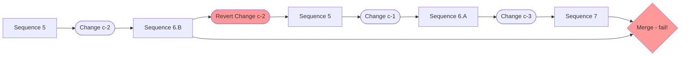
```mermaid
  flowchart LR
    s5[Sequence 5]
    s5_[Sequence 5]
    s6a[Sequence 6.A]
    s6b[Sequence 6.B]
    s7a[Sequence 7]
    c1([Change c-1])
    c2([Change c-2])
    rc2([Revert Change c-2])
    c3([Change c-3])
    m{Merge - fail!}

    s6b --> rc2 --> s5_ --> c1 --> s6a --> c3 --> s7a --> m
    s5 --> c2 --> s6b --> m

    style m fill:#f99
    style rc2 fill:#f99
```

Device B prevents this by looking at `lastSynced`. Device B sees that `serverX.walletState.lastSynced[deviceB.id]` is still 5, while `deviceB.walletState.sequence` is 6. This tells Device B that Sequence 7 does not include Sequence 6.B (and thus Change c-2). It means that somehow or other, the server and clients got into an inconsistent state. To prevent further trouble, Device B goes into Error Recovery Mode.

The server cannot forge `lastSynced`. A device could forge it, but again, in our model we necessarily assume that the devices are trusted.

NOTE: An advancement we could make would be to store more historical versions. In this case, if Device B happened to have Sequence 5 lying around, it could recover. But, the user may need to manually merge the changes between 5 and 6.B twice. Also, this might lead to servers being less disciplined. And it adds complication. But, it's an option for consideration.

# Network issues

TODO

I pushed Seq 4. I make changes. I push Seq 5. B/c of network error I'm not sure if I succeeded. I push again just in case. It's now rejected. I pull. What merge base will it claim?

I need to have both Seq 4 and Seq 5 around until the server confirms to me which is the last one that succeeded. It could lie to me about what it accepted, but I would catch it when it came time to merge something else, as described in a previous scenario,

For this reason, server should always confirm committing the change locally before returning a success. (server commit change should be a self-action in this example)

# Three Devices

TODO - maybe lots to consider

# New device appears in the middle of the sequence

TODO - how will it merge in? etc etc.

# TODO

Merge this document with states.md? What should be charts vs the math notation?

Some oddball sequences that I came up with in states.md may want charts. And vice versa.
