# Initial Setup


source

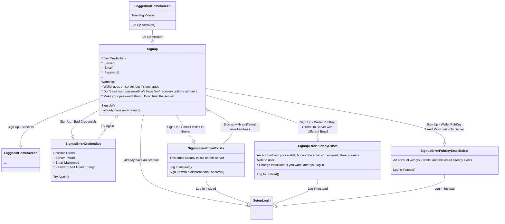

# Account Recovery


source

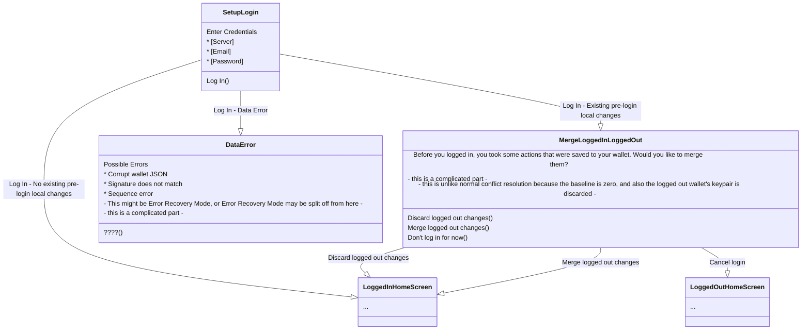

# Set Up Additional Device

The only difference between this and Account Recovery is that there is another device connected somewhere. The one place this could change the flow is if that device pushes a change while this device is in the middle of MergeLoggedInLoggedOut.


source

# Make Logged In changes to wallet

source

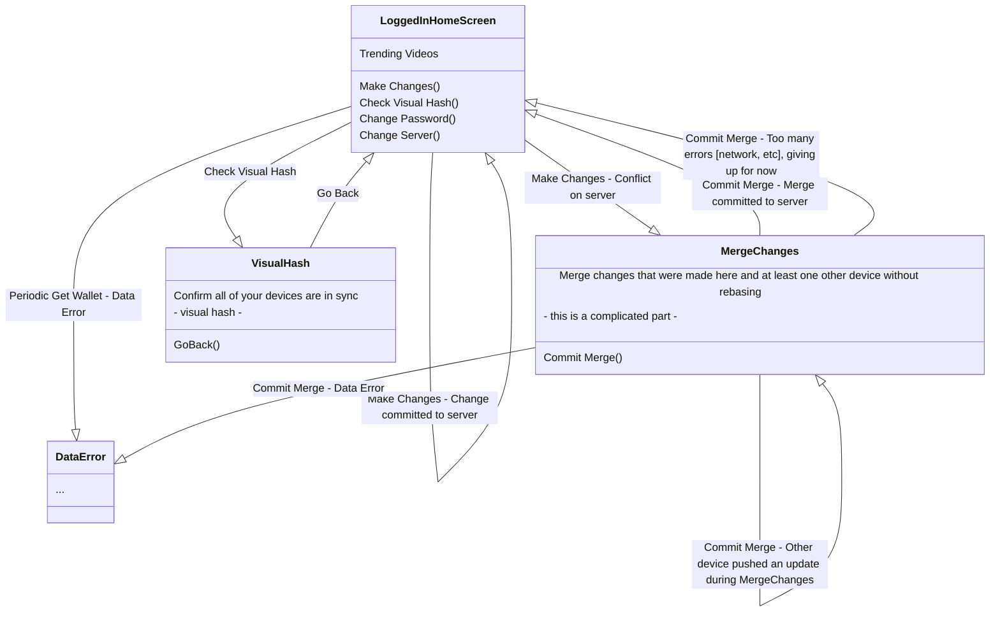

# Change Password

Password changes will happen in the same line as other changes to the walletState:

* A password change (with no other changes) will add a new walletState with a new sequence.
* It will be necessary to pull the latest walletState before pushing a password change.

## If you are *initiating* a password change on a given device:

To simplify the flow, we don't allow the user to initiate a password change (A) on their device while that device has unmerged changes to their wallet. This way, if another device pushes a change (with the previous password), it can be trivially merged before applying the password change and pushing it back to the server.

However, if another device pushes a different password change (B), we have to cancel the password change (A) on this device. This is because we need the user to input password (B) first to decrypt the latest wallet. We can't just overwrite it with password (A) because the latest wallet may also have changes that we need to merge in. Though we interrupt the password change (A), we invite the user to change the password to (A) again later if they want, but we leave it to them.

## If you are *confirming* a password change created on another device:

Supposing the password is changed from (P) to (A) on another device, and the user gets a **password confirmation prompt** on this device.

If another device changes the password _again_ to (B) in the middle of the **password confirmation prompt**, we should be able to hide the complications from the user. The user probably expects password (B) to work, so that's what we will expect. This means that we will pull the wallet again _after_ the user enters their password to confirm that it decrypts.

If a third device also creates a change to the wallet it will have the password (B), assuming other clients are working correctly. This is because no clients will push until they've updated their own password to what's on the server. It won't have passwords (P) or (A). The only exception is if this third device also _initiates_ a new password change. In all, every wallet on the server should be assumed to be encrypted by the most recent password change initiation that is accepted by the server.

If there is a wallet change along with the password change, it can be merged in cleanly if there are no local changes. If there are local changes, they can be resolved with MergeChanges after password (B) is confirmed. If another device changes the password _again_ during the MergeChanges screen, the merge will fail simply because the wallet on the server is updated. The new wallet will be pulled, the device will see that the password doesn't match (B), and it will bring up the **password confirmation prompt** again. At this point it can safely discard password (B), because we no longer need the wallet encrypted by password (B). We have yet to make and push a successful merge, so our local baseline is still the wallet encrypted with password (P). All of the changes that we have yet to merge are in the wallet with password (C).


source

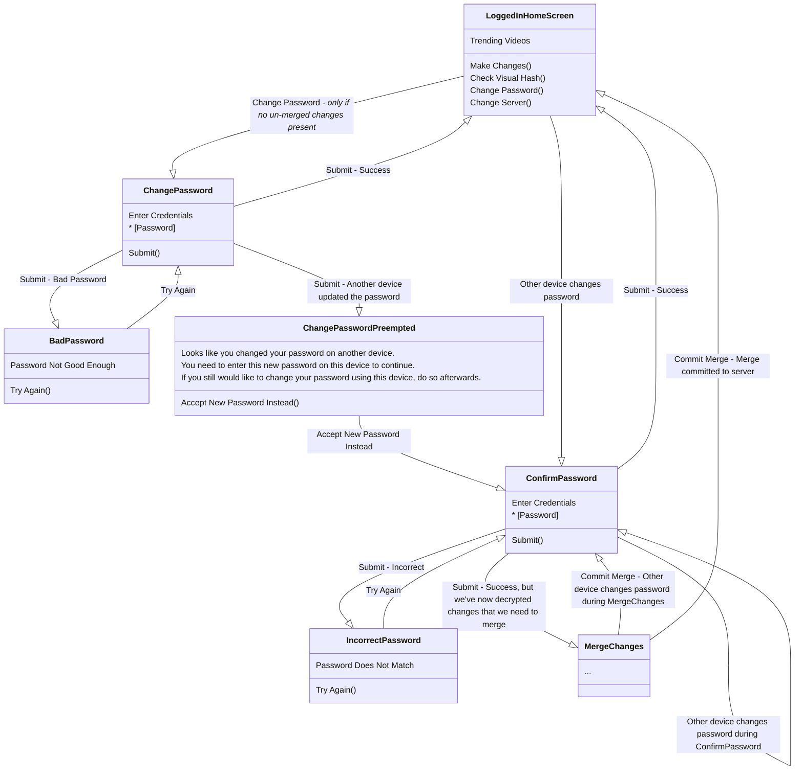

# Turn On Application and Log In

There is an edge case when starting the app. If _both_ of the following are true:

* A password change is waiting on the server
* There are local _unmerged_ changes on the device

then the user will need to enter both their old and new passwords on startup. The old password will decrypt the local wallet, and the new password decrypt the wallet on the server.


source

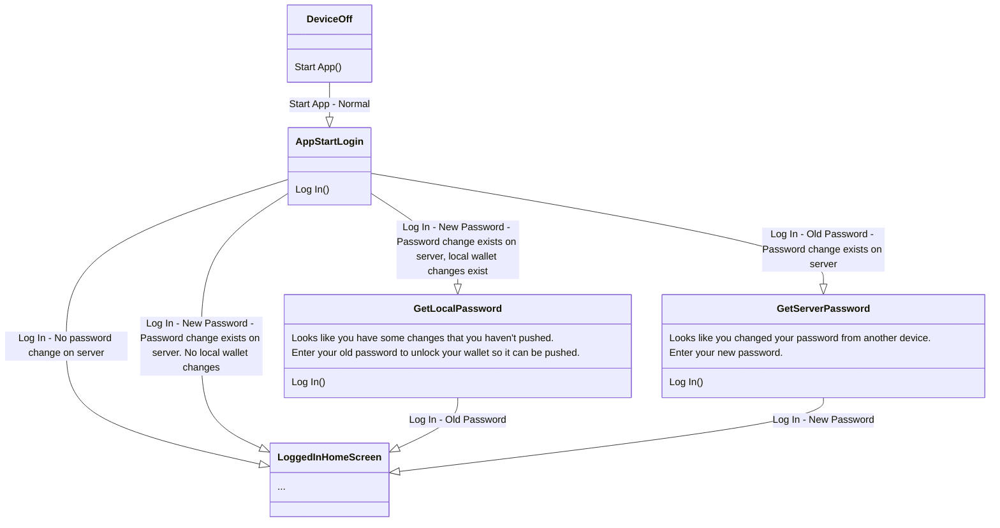

# Change Server


source

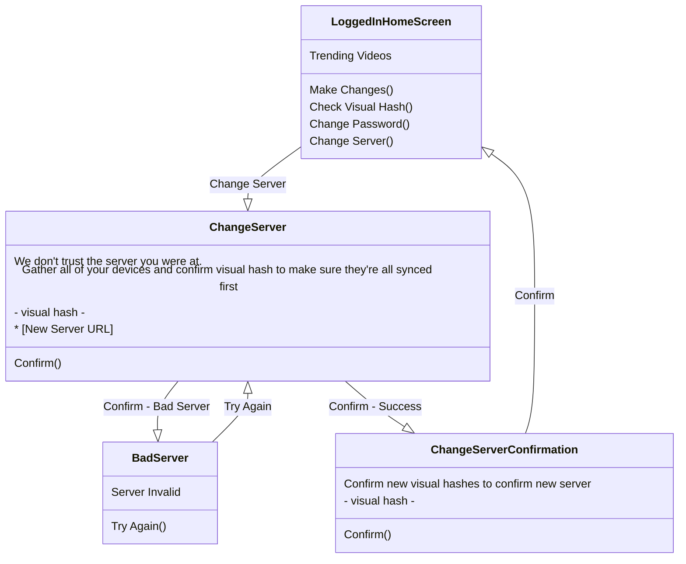

