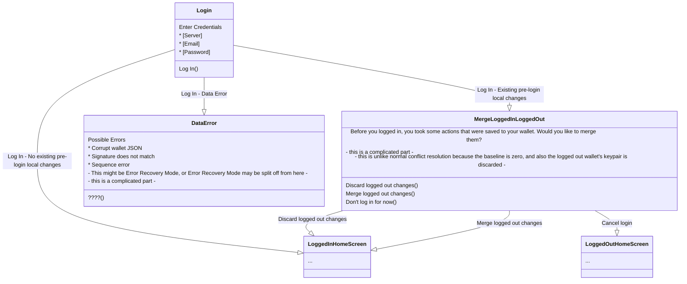

# Initial Setup

source

# Account Recovery / Login

source

# Set Up Additional Device

The only difference between this and Recovery / Login is that there is another device connected somewhere. The one place this could change the flow is if that device pushes a change while this device is in the middle of MergeLoggedInLoggedOut.

source

# Make Logged In changes to wallet

source

# Change Password

To simplify the flow, we don't allow the user to initiate a password change on their device while that device has unmerged changes to their wallet. This way, if another device pushes a change, it can be trivially merged before applying the password change and pushing it back to the server.

However, if another device pushes a different password change (B), we have to cancel the password change (A) on this device. This is because we need the user to input password B first. We need password B to know if there are any changes to the wallet in addition to the password. During the process we invite the user to change the password to A again after if they want, but we leave it to them.

source

# Change Server

source

