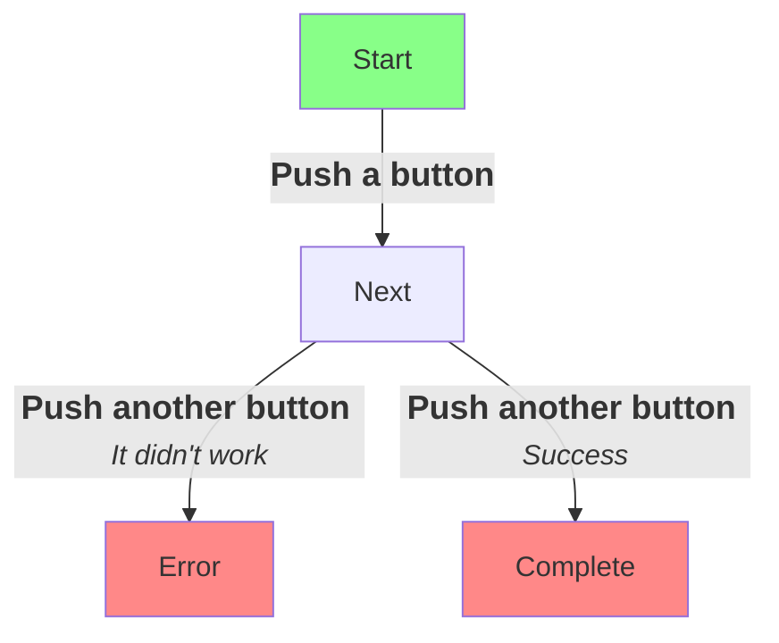
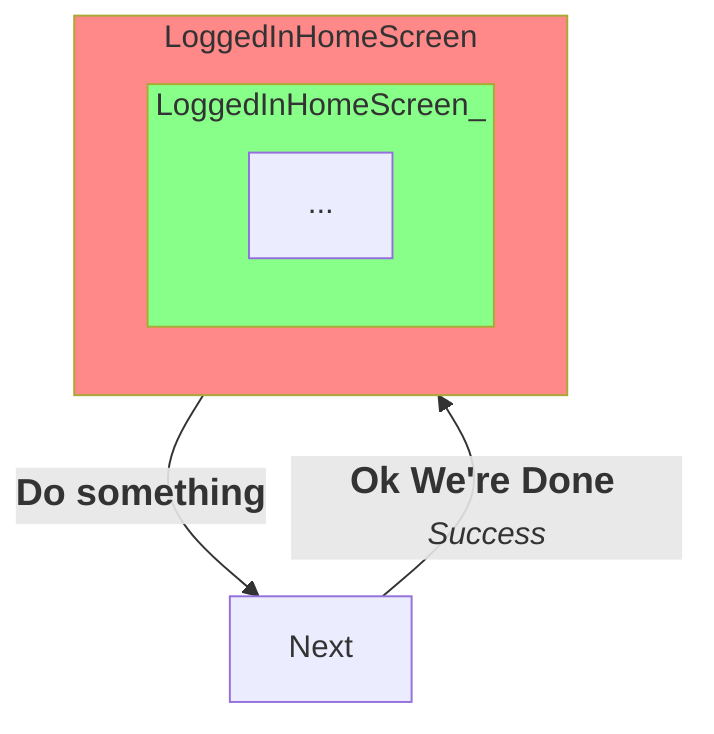
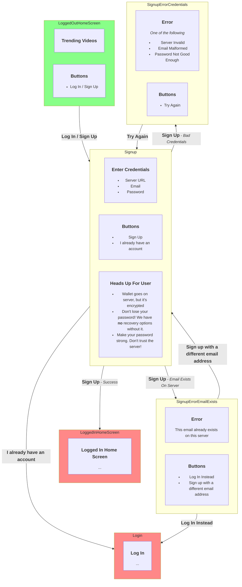
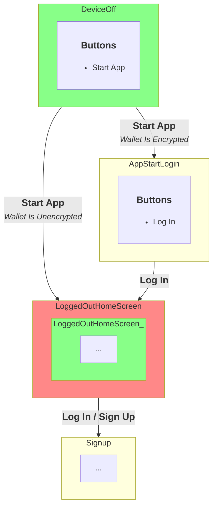
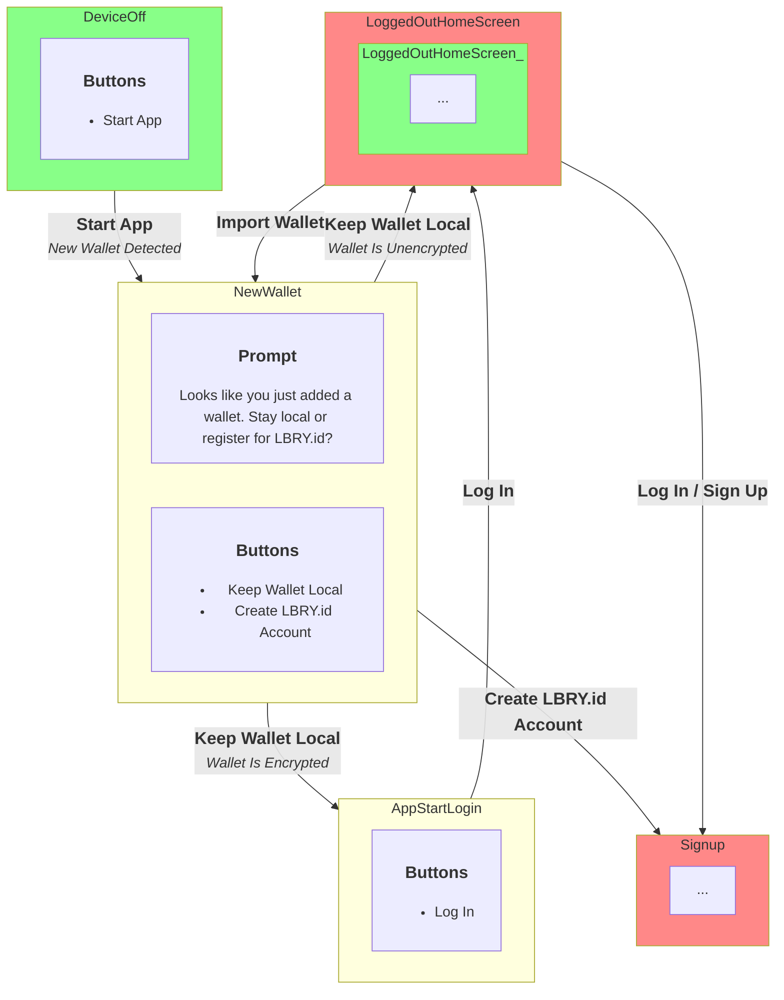
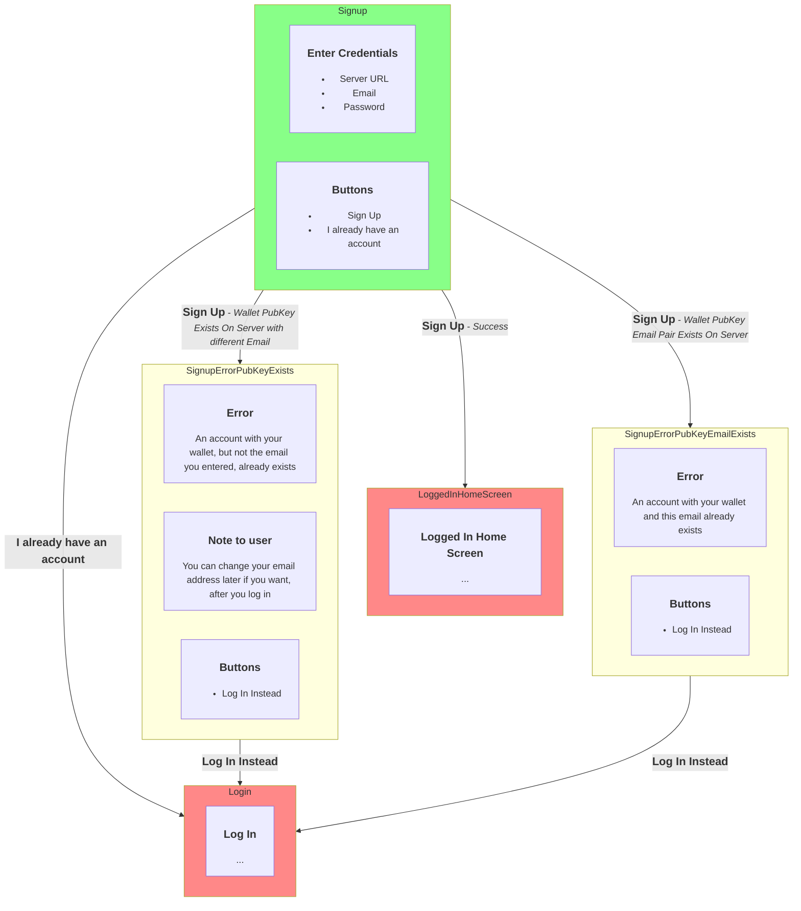
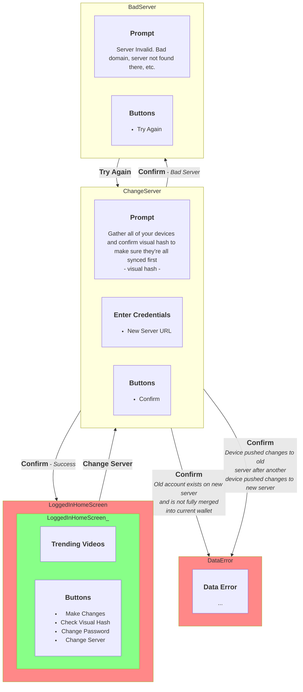

# Key

This document describes the flow for users in as many interesting scenarios as we can reasonably consider. The diagrams will represent states, including what the screen will show, what buttons the user can push, etc. The arrows between the states will indicate what caused the state to change, along with caveats. Usually the user pushed a button, and some context surrounding it (success, invalid input, etc).

Since these diagrams can get a little gnarly, we'll make it a little easier to follow by coloring the starting states **green** and the ending states **red**.

Sometimes a starting state will also be the ending state for a given scenario. For instance, a user starts on a home screen, performs an action, and is back on the home screen doing what they were doing before. In this case, we color the state both **green** and **red**.

# Initial Setup

The user starts the app logged out, but they still have a wallet and can interact with the app in most ways.

If they decide to sign up, they enter their credentials. If they succeed, their wallet is uploaded and associated with their account, and they're logged in.

They could fail because the email address already exists on the server. At this point they're invited to log in to their existing account if that address is theirs. Otherwise they're asked to try signing up with a different address.

<!-- Mermaid note:
     I don't know why `direction RL` within the subgraphs makes it go top-down.
     TD doesn't make subgraphs go top-down. Maybe it's a bug that they'll fix
     in which case we'll need to change these to TD. -->

# Account Recovery

A user has no access to any devices that have a copy of their wallet, but they have a wallet on a lbry.id server. They install the app and log in.

Just like with account signup, the user will have a wallet before they log in. Once they log in, they'll have two wallets: the one they had before logging in, and the one that just came from the server.

If they made changes on the app before logging in, they will have logged in and logged out changes to merge at this point. This is a different sort of merge because there is no "baseline" version. (Effectively the baseline is an empty wallet file). We may also give the user the option to throw out their logged out changes.

TODO - details about this merge

# Set Up Additional Device

The only difference between Setting up an Additional Device and Account Recovery is the existence of another device connected somewhere. The one place that device could change the flow is if it pushes a change while this device is in the middle of `MergeLoggedInLoggedOut`.

# Unpushed encrypted local changes on startup

There is an edge case when starting the app. If _both_ of the following are true:

* A password change is waiting on the server
* There are local _unmerged_ changes on the device

then the user will need to enter both their old and new passwords on startup. The old password will decrypt the local wallet, and the new password decrypt the wallet on the server.

* Can we just push all changes before they quit? We can certainly try, but we can't guarantee it.
* Can we just delete all changes before they quit? Figuring out a way to do this without them losing important data may be tough.

It may be simpler to just find a way to account for the rare case that they have data on startup. And we can do our best to keep this as rare as possible by the above two methods.

# Turn On Application and Log In

When we turn on the app, if the wallet is unencrypted and there's no online account associated, we go straight to the logged out home screen. If it's encrypted, we have to ask for a password. If there's also a LBRY.id account, that same password will be used for that as well.

TODO - Perhaps it can be unencrypted but still have a LBRY.id account. Still sorting out that possibility. Maybe not advisable.

# Recover with Imported Wallet

A user may have an existing wallet file which they wish to Import into the app. They might use our dialog, or they might try to be tricky and replace the file themselves. (For the latter case, we'll need some way to detect it. Probably that the key pair changed; maybe we keep a copy of the public key somewhere else.)

The imported wallet may or may not be encrypted. If it's encrypted, the user will need to put in their password whether or not they want to create an account.

At this point the app will not have associated the wallet with a lbry.id account, whether or not an account already exists.

When the user Imports a Wallet, the signup/login process will have a couple of new error states in addition to `SignupErrorEmailExists` from above. It may be possible that the pubkey from the existing wallet file is already associated with a lbry.id account. If this is the case, and the user tries to create a new account, they will be invited to log in instead.

If the imported wallet already has a LBRY.id account associated with it, it is possible that it has diverged from the version on the server. Since either might have changed, merging may be in order.

Usually when we make changes to wallets, we have a baseline for the purpose of merging. Imported wallets will not have this, so the user might have a more annoying merge to deal with. It'd be the same type of merge as `MergeLoggedInLoggedOut` above (and happen in the same part of the login flow).

NOTE: Perhaps we could somehow add baseline (and other metadata) to wallet import/export so that we could do a normal merge here.

<!--

TODO - What if you have a wallet, copy it manually to a few devices, and then try to start the syncing? Make sure that it enters manual recovery mode, because we can't be sure that it's in sync without the metadata trail.

Though on the real - what we figure out whether to sync or not, or whatever, is:

* The unsynced change
* The walletstate before the new changes
* The walletstate on the server now (can pull to see)
* That's all. That's your merge.

The metadata is only to make sure that the server isn't lying about how much of the client's previous changes it has incorporated.

-->

# Make Logged In changes to wallet

TODO - consider "Periodic Get Wallet" that doesn't lead to data error. If there's no merge conflict, there's no user interaction to model (though we should leave a note about it). What about if there is a conflict? I guess we skip that, because we should instead follow the "make changes" path, since we want to push ASAP, right?

TODO - other buttons. Change Password, etc? Or is that not this flow?

# Change Password

Password changes will happen in the same line as other changes to the walletState:

* A password change (with no other changes) will add a new walletState with a new sequence.
* As with any other walletState changes, it will be necessary to pull and merge the latest walletState before pushing a password change.

## Summary

Now that we have wallet content changes _and_ password changes, we will have a lot of different user screens to consider in the diagrams below.

We can summarize the situation as a simple heirarchy, albeit with some nuanced rules. Sometimes a rule prevents an action. Sometimes a rule preempts an action with another action if remote and local actions happen concurrently. Sometimes, a rule causes an action to happen silently, without bothering the user. A higher level on this heirarchy will preempt or prevent a lower level:

### Merge in remote password change

This involves user interaction (entering the new remote password on the local device).

This change takes highest priority.

### Merge in remote wallet changes

This sometimes involves user interaction (conflict resolution, if there is a merge conflict with local wallet changes).

* Can't happen if there is a **remote password change** pending. This is by virtue of the fact that the local device can't decrypt the new remote wallet changes without knowing the new remote password.

### Push Local wallet changes

This requires no user interaction.

* Can't happen if there are **remote wallet changes** pending. We need to merge those in first. However if they merge cleanly with the local changes, it will require no user interaction.

* Can't happen while there is a **remote password change** pending. Without the new remote password, the local device can't know if there are also remote wallet changes. Besides, from this point on we don't want the local device to produce any new wallets encrypted with the old password; we want to change the local password to match the new remote password.

### Push local password change

This involves user interaction (entering a new local password).

* Can't happen while there are **local wallet changes** pending: It's forbidden as a rule just to keep our system simpler.

* Can't happen while there are **remote wallet changes** pending: We don't want to overwrite remote wallet changes without merging them in. However, because of our rule against local changes, we can guarantee that the merge will require no user interaction. We can pull and apply those changes silently if they come while the user is entering a new password.

* Can't happen if there is a **remote password change** pending: If the remote password changed, there might also be new remote wallet changes that we can't see without decrypting it, so we need to enter the remote new password. If the remote password changes *while* the user is creating a local password change, we will *discard* the local new password and instead adopt the remote new password. This is just to simplify the UI (for both user and developers).

## Initiating a password change

NOTE: We are assuming here that the "Change Password" button is on the home screen for simplicity. We will likely want to revise this with a settings screen.

### Simple Case

A user wants to change the password from `P0` to `P1` using Device A. They click on the Change Password button on their home screen and get a prompt. They try entering a few passwords. The first one fails because it doesn't match. The second one fails because it's not strong enough. The third one succeeds, and they go back to the home screen.

### Blocked by local wallet changes

A user wants to change the password from `P0` to `P1` using Device A. The password change button is greyed out for the moment, because there are local wallet changes that have not yet been pushed. Later, the changes have been pushed, and the button appears. The user clicks the button, changes their password successfully, and goes back to the home screen.

### Not blocked by remote wallet changes

A user wants to change the password from `P0` to `P1` using Device A. The user clicks the button and enters the new password, but they do not yet submit. They then go to Device B and make some changes to wallet content, and it gets pushed to the server. The user then submits the password they entered on Device A. At this point, the password gets submittend and the user goes back to the home screen.

Under the hood, Device A is interrupted by having to download the wallet changes from Device B before pushing the new password. However we can guarantee that there will be no need for conflict resolution, because there are no wallet changes on Device A. If there are network problems in downloading, the error can be presented to the user the same way as network problems when submitting the password.

### Canceled by remote password change

A user's current password is `P0`. They open the password change screen on both Device A and Device B. They submit `P1` on Device B. They then submit either `P1` or `P2` on Device A. At this point, Device A shows the `ChangePasswordPreempted` prompt which will inform them that the password has been changed on a different device (Device B), that the password they just entered on Device A has been discarded (though they're welcome to submit it again later), and that they now need to confirm the new password (the one submitted on Device B).

NOTE: We could sometimes simplify this for the user: If the user submits `P1` on _both_ devices, Device A would have `P1` in its memory. This could serve as the confirmation for the incoming password change created by Device B. It could skip the `ChangePasswordPreempted` and go straight back to the home screen as if nothing happened. However, we will assume that changing password simultaneously on two devices is rare in the first place. For now we will not complicate our UI design with this minor improvement in user convenience. We are only considering this edge case to make sure we have _something_ to handle it.

NOTE: We could simplify our design at the expense of the user's convenience, perhaps, by sending the user from `ChangePasswordPreempted` to the home screen instead of the password confirmation screen.

## Confirm a password changed on another device

For this section, we are assuming that there are no new remote wallet changes, only _password changes_.

### Simple Case

A user has changed the password to `P1` using Device B. The go to their home screen on Device A and see a new button: "Confirm New Password". They click it and are taken to the password confirmation screen. On their first attempt they enter `P1` incorrectly. On the second attempt they get it right and go back to the home screen.

### Multi Change Case

A user has changed the password multiple times using Device B: from `P0` to `P1` to `P2` to `P3`, while Device A has been offline. The user takes Device A online again, and sees the "Confirm New Password" button on their homescreen. They click it, enter `P3` successfully and return to the home screen.

Under the hood, any wallet on the server (assuming it's working properly) will at that point contain all of the latest data. It will be encrypted using the latest password. Previous password changes do not matter.

### Multi Change During Prompt Case

A user has changed the password from `P0` to `P1` using Device B. The user picks up Device A and sees the "Confirm New Password" screen on their homescreen. They click it, but don't enter the password yet. They realize that they prefer a different password. They go to Device B and change the password again from `P1` to `P2`. They go back to the password confirmation screen on Device A and enter `P2`. This is accepted and the user is taken back to the home screen.

Under the hood, Device A will pull the latest wallet from the server before confirming a password change. This is to check for such additional password changes. The latest password is the one that will be expected.

NOTE: This is a rare case, and it would be simpler to design and implement for the application to expect `P0` rather than pulling from the server before accepting. However, rare as this is, it may be good to avoid confusing the user. The user probably expects the most recently submitted password to work. However, this can be changed. One alternative could perhaps be to display an error on Device A and send the user to the home screen instead.

### Start from Preempted Case

A user tried to use the password change screens on both Device A and Device B at the same time, and ended up on `ChangePasswordPreempted` on Device A. From here, they are sent to the password confirmation screen. They successfully enter the password originally submitted on Device B, and return to the home screen.

### Data Error Case

The user has changed the password using Device B. On Device A, instead of seeing the "Confirm New Password" button, they see a scary looking "Sync Error" alert. They click it and find that there was a problem with the latest wallet sent by Device B, and that they need to enter Error Recovery Mode.

Under the hood: If the server presents the device with a new wallet with a password change that is _out of sequence_ for any device (see `lastSyncedById` in the [sync](sync.md) document), we want to know *before* the user enters the password. It could be a very old password that the user has forgotten, which would leave the user stuck without understanding why. For this reason, the metadata that holds the sequence data should be _unencrypted_.

## Confirm a password change along with additional changes from another device

Supposing the user has changed their password (**Sequence 3**) and made additional changes to their wallet before (**Sequence 2**) and after (**Sequence 4**), all on Device B. Device A has not yet applied anything after **Sequence 1**. The latest version of the wallet with all of these changes is on the server, encrypted with the _new_ password. Thus, when Device A receives Changes 2-4 from the server all at once, it cannot read any of them until the user enters the new password into Device A.

Meanwhile, there are unmerged local wallet changes on Device A that it cannot push until Device A is up to date. Furthermore, those changes have a conflict with the new wallet changes coming from Device B. Thus, after the user enters the new password on Device A allowing Device A to decrypt the new changes, the user will immediately need to resolve the conflict.

It's also possible that, while handling the merge conflict on Device A, the user changes the password _again_ on Device B. In this case, after completing (or cancelling) the merge conflict resolution, the user will once again be asked to enter this latest password on Device A. After this, the user will be asked to resolve the merge conflict _again_ from the beginning (this is expected to be rare, but it will simplify the design).

We can't easily prevent these scenarios. We do stop the user from changing the password while there are unmerged local changes _on the same device_, which cuts down on complication. However doing the same _across_ devices, at least at first glance, would require a protocol change that would add more complication than it alleviates. However, if there is enough demand, some more consideration could be given to finding a better solution.

Once a password change is initiated, every client will need to update its password before submitting any further changes. Thus, assuming the clients are behaving properly, the password won't ever accidentally go back.

## Recovering from forgetting a new password just entered.

TODO

<!--

# TODO - I just changed my password but I forgot it. I'd like to change it again.

This is just to make sure that this flow should be possible. They should never get stuck having to put in a recently entered password. Don't forget that the server can't save them.

When putting in a new password, they probably shouldn't need to put in their old password anyway, so this should be automatically covered. But perhaps we do want to ask for old password for security reasons somehow. It's not too uncommon. If that's the case, maybe we can not require it for the first hour or something?

-->

## Putting it together

Here's a graph that allows for the most complicated scenario: One one device, we change password. However, it is preempted by a password change along with other changes come from another device.

# Change Server

Changing servers involves changing the lbry.id domain on each of the user's devices, continuing the syncing process on the new server, and making sure that any wallet changes remain intact over the process.

The ideal scenario is the following: The user gathers _all_ of their devices. They make sure that all local changes are pushed and all remote changes are downloaded. At this point, every device should be on the same state, and this can be confirmed by comparing visual hashes on the devices. The user then switches every device one by one to the new server. At this point, the user can start making changes to wallets as before.

Supposing the user deviates a little from this. They get to the point where every device has the same visual hash. The user moves one device to the new server, but they also make a change to the wallet on that server before moving other devices. Because of sequence numbers, this will be fine: After the second device is moved to the new server, it will see the first device's pushed changes and pull them before pushing any of its own new changes.

## Problems and partial solution

Supposing the user deviates a little more. Instead of following the guidelines, they make multiple changes on two different devices on two different servers. Then, they finish moving all of their devices to the new server. At this point, changes created by one of the devices will likely get lost. However, if we use the device-sequence map (see `lastSyncedById` in the [sync](sync.md) document), we can at least detect this state and alert the user to there being a problem (the `DataError` state), which leads to an error recovery mode (an ugly conflict resolution). This would be similar to the "dishonest server" I describe in the sync document.

Another problem would be if the user has a device that they forgot about that they keep connected to the old server. Or similarly they add a new device to the old server by accident. This is ultimately the responsibility of the user, and we can yell at them to make sure they don't do this.

Another possibility to note: there might be an existing account on the new server. Perhaps the user created it a while ago. If it's old, it means that the sequence number will be low, so it will _usually_ be overwritten. However, it's also possible that not all data got merged when the user left that account previously. Again, if we have the device-sequence map, we can detect this and enter the `DataError` state.

## Potential further solution

We're left with user error that could lead to `DataError`, or devices left on the old server, and maybe that's okay. But we could consider an option that could mitigate or perhaps prevent this.

We could make the server change process similar to the password change process: we could push a walletState to the _old_ server with a special directive (in encrypted metadata) that informs other devices of the intention to switch to the new server. Clients still on the old server would be forced to receive this message before pushing any local changes, and would thus push them to the new server. This would mitigate the `DataError`.

It may also be simpler for the user, because they would only need to initiate the server change on one device. However, we may want to continue making the user responsible for confirming that every device has changed to the new server. The old server might be malicious and hide this directive from some devices. Also, the old server might disappear altogether, so we should keep open the option of having the user manually do the task. Also, maybe for security reasons they should get a popup. "IF YOU DID NOT INITIATE THIS CHANGE YOU MAY BE UNDER ATTACK" or whatever.

## TODO

Prevent changing password while changing server, oof. At very least just tell them not to do it. But we could probably just add "server change" to the preemption hierarchy above.

Again, it's not that I want to complicate things with this possibliity. It's that we don't have totalitarian control over the user's devices, and we want to prevent them from shooting themselves in the foot (data loss) if we can, even if it's a rare case.

